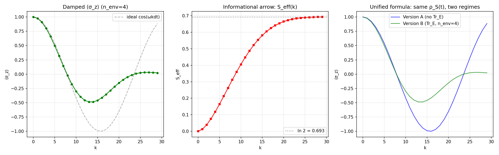
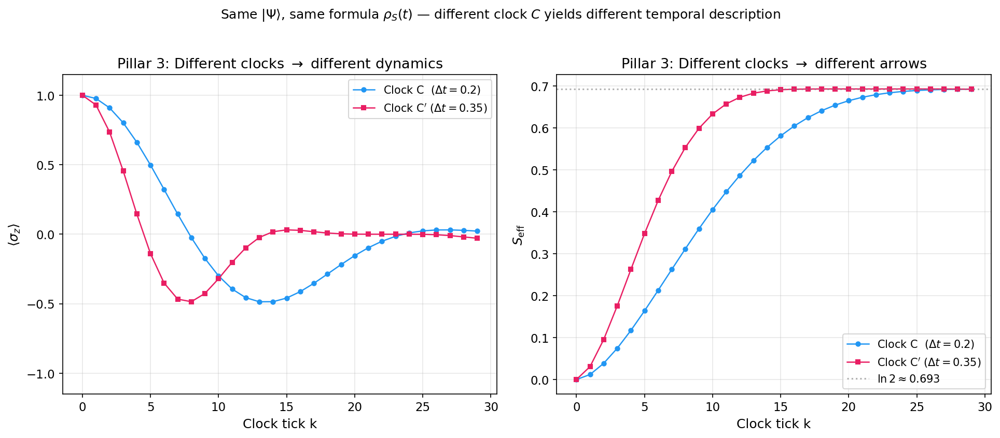

# The Observer as a Local Breakdown of Atemporality

Numerical demonstrator for the unified relational formula:

```
                    Tr_E [ ⟨t|_C  |Ψ⟩⟨Ψ|  |t⟩_C ]
    ρ_S(t)   =    ─────────────────────────────────
                                p(t)
```

Three pillars of the problem of time from one expression:

| Operation | What it produces | Pillar |
|-----------|-----------------|--------|
| ⟨t\|\_C (projection) | Schrödinger dynamics | Quantum mechanics |
| Tr\_E (partial trace) | Entropy growth, irreversibility | Thermodynamic arrow |
| C is local (not global) | Observer-dependent time | Relational time |

> Gabriel Giani Moreno (2026)

Implemented with [QuTiP](https://qutip.org/).

**Repository:** [https://github.com/gabgiani/paw-toymodel](https://github.com/gabgiani/paw-toymodel)

---

## Documentation

| Document | Description |
|----------|-------------|
| **[Theory](docs/THEORY.md)** | The unified relational formula, three pillars, and the observer as anomaly |
| **[Scripts & Outputs](docs/SCRIPTS.md)** | Complete guide to every script, figure, and CSV |
| **[The Omniscient Observer](docs/GOD_OBSERVER.md)** | Boundary analysis: what happens when the observer has complete access |
| **[Geometric Structure](docs/GEOMETRY.md)** | Bloch trajectory, relational bundle, and the arrow as geometry |
| **[Step-by-Step Derivation](docs/DERIVATION.md)** | The formula developed from first principles, operation by operation |
| **[Gravity Robustness](docs/THEORY.md#gravity-robustness)** | Three tests: backreaction, fuzzy boundaries, clock uncertainty |
| **[Structural Robustness](docs/THEORY.md#structural-robustness)** | Poincaré recurrences, initial states, partition independence |
| **[IBM Quantum Validation](docs/THEORY.md#experimental-validation-on-ibm-quantum-hardware)** | Pillars 1 & 2 confirmed on ibm_torino (real QPU), error bars, noise characterisation |

---

## Quick Start

```bash
python -m venv venv
source venv/bin/activate
pip install -r requirements.txt
```

```bash
python run_all.py                       # Pillars 1 & 2 + all metrics
python generate_pillar3_plot.py         # Pillar 3 (two-clock comparison)
python generate_god_observer_plots.py   # Boundary analysis (omniscient observer)
python generate_geometry_plots.py       # Geometric interpretation (Bloch trajectory)
python generate_gravity_robustness.py  # Gravity robustness (3 tests)
python generate_structural_robustness.py # Structural robustness (3 tests)

# IBM Quantum hardware validation (requires API key)
pip install qiskit qiskit-ibm-runtime
python IBMquantum/run_ibm_validation.py --mode both
python IBMquantum/run_ibm_enhanced.py --mode all --n-runs 3  # error bars + noise
```

All figures (PNG) and tables (CSV) are saved to `output/`.

---

## Key Results at a Glance

### Pillar 1 — Projection yields dynamics


Conditional ⟨σ\_z⟩(k) matches analytic cos(ωkdt) with machine precision (max deviation ~ 4×10⁻¹⁶).

### Pillar 2 — Partial trace yields the arrow



Adding an environment: oscillations damp, entropy grows from 0 → ln 2. Same formula, different access.

### Pillar 3 — Clock locality yields observer-dependent time



Two clocks (dt = 0.20 vs 0.35) produce different temporal narratives from the same global state.

---

## Structure

| File | Description |
|------|-------------|
| `paw_core.py` | Core simulation functions (reusable module) |
| `validate_formula.py` | Formula validation with step-by-step pillar verification |
| `run_all.py` | Full pipeline: all versions, metrics, plots, and CSVs |
| `generate_pillar3_plot.py` | Two-clock comparison (Pillar 3) |
| `generate_god_observer_plots.py` | Omniscient observer boundary analysis |
| `generate_geometry_plots.py` | Geometric interpretation (Bloch trajectory + bundle) |
| `generate_gravity_robustness.py` | Gravity robustness (backreaction, fuzzy boundaries, clock blur) |
| `generate_structural_robustness.py` | Structural robustness (Poincaré, initial states, partitions) |
| `IBMquantum/run_ibm_validation.py` | IBM Quantum hardware validation (Pillar 2 on real QPU) |
| `IBMquantum/run_ibm_enhanced.py` | Enhanced validation: error bars, noise characterisation, Pillar 1 on QPU |
| `test_god_observer.py` | Console validation of three omniscience levels |
| `run_essay_validation.py` | All 3 pillars — clean ASCII output |
| `paw_toymodel.ipynb` | Interactive Jupyter notebook |
| `requirements.txt` | Python dependencies |
| `output/` | 21 figures (PNG) + 11 data tables (CSV) |
| `IBMquantum/output/` | 2 figures (PNG) + 2 data tables (CSV) + 1 noise JSON — hardware results |

## Reference Parameters

| Parameter | Value |
|-----------|-------|
| N (clock levels) | 30 |
| dt (time step) | 0.2 |
| ω (system frequency) | 1.0 |
| g (coupling strength) | 0.1 |
| n\_env (environment qubits) | 2, 4, 6, 8 |
| \|ψ₀⟩\_S (initial state) | \|0⟩ |
