# The Observer as a Local Breakdown of Atemporality

[](https://doi.org/10.5281/zenodo.18577871)
[](LICENSE)

## What Is This?

In quantum gravity, there is a deep puzzle known as the **problem of time**: the fundamental equations of the universe (the Wheeler–DeWitt equation) describe a *timeless* state — yet we clearly experience time flowing, clocks ticking, and entropy growing. How does time emerge from a theory that has none?

In 1983, Don Page and William Wootters proposed an elegant answer: time is not fundamental but **relational**. A subsystem of the universe acts as a "clock," and the temporal evolution of everything else is recovered by asking: *"what does the system look like when the clock reads t?"* This is the **Page–Wootters (PaW) mechanism**.

This repository takes that idea and extends it. We show that a single mathematical expression — the **unified relational time formula** — is enough to produce not just quantum dynamics, but also the **thermodynamic arrow of time** (why entropy grows) and **observer-dependent time** (why different observers can disagree about temporal descriptions). Three pillars of the problem of time, from one formula:

$$\rho_S(t) = \frac{\mathrm{Tr}_E\!\big[\langle t|_C\;|\Psi\rangle\langle\Psi|\;|t\rangle_C\big]}{p(t)}$$

The key insight is that the **observer** is not a passive spectator — it is a *local anomaly* in the global atemporality. By choosing a clock ($C$) and tracing over inaccessible degrees of freedom ($\mathrm{Tr}_E$), the observer *creates* the temporal experience. Remove the observer's limitations, and time dissolves back into the timeless whole.

### Three Pillars from One Formula

| Operation | What it produces | Pillar |
|-----------|-----------------|--------|
| ⟨t\|\_C (projection) | Schrödinger dynamics | Quantum mechanics |
| Tr\_E (partial trace) | Entropy growth, irreversibility | Thermodynamic arrow |
| C is local (not global) | Observer-dependent time | Relational time |

### How the Framework Fits Together

```mermaid
flowchart TD
    F["<b>Unified Relational Time Formula</b><br/>ρ_S(t) = Tr_E[ ⟨t|_C |Ψ⟩⟨Ψ| |t⟩_C ] / p(t)"]

    F --> P1["<b>Pillar 1 — Dynamics</b><br/>⟨t|_C projection<br/>→ Schrödinger evolution"]
    F --> P2["<b>Pillar 2 — Arrow of time</b><br/>Tr_E partial trace<br/>→ entropy growth"]
    F --> P3["<b>Pillar 3 — Observer-dependence</b><br/>Clock C is local<br/>→ relational time"]

    P1 --> V1["Toy model<br/><i>max deviation ~ 10⁻¹⁶</i>"]
    P2 --> V2["Toy model + environment<br/><i>S → ln 2 monotonically</i>"]
    P3 --> V3["Two-clock comparison<br/><i>same |Ψ⟩, different histories</i>"]

    V1 --> QPU["IBM Quantum<br/>(ibm_torino)"]
    V2 --> QPU
    V3 --> QPU

    P1 --> R["Robustness tests"]
    P2 --> R
    R --> RG["Gravity: backreaction,<br/>fuzzy boundaries, clock blur"]
    R --> RS["Structural: Poincaré,<br/>initial states, partitions"]

    F --> GO["<b>Boundary analysis</b><br/>Omniscient observer<br/>→ time disappears"]

    F --> GEO["<b>Geometric interpretation</b><br/>Bloch trajectory,<br/>relational bundle"]

    style F fill:#cce5ff,stroke:#007bff
    style P1 fill:#d4edda,stroke:#28a745
    style P2 fill:#d4edda,stroke:#28a745
    style P3 fill:#d4edda,stroke:#28a745
    style QPU fill:#f8d7da,stroke:#dc3545
    style GO fill:#fff3cd,stroke:#ffc107
    style GEO fill:#fff3cd,stroke:#ffc107
```



### What's in This Repository

Everything here is **numerically verifiable**. The repository contains:

- A **toy model** (1 qubit + up to 8 environment qubits) that demonstrates all three pillars
- **Robustness tests** showing the results survive gravitational corrections, different initial states, and Poincaré recurrences
- **IBM Quantum hardware validation** — the formula was tested on a real quantum processor (ibm\_torino), confirming the theoretical predictions with error bars
- A **boundary analysis** (the "omniscient observer") exploring what happens when you give the observer complete access — time disappears, as predicted
- **Geometric interpretations** showing how the arrow of time traces a path on the Bloch sphere
- An **independent extension** studying observational asymmetry between systems with different access structures

The mathematics draws on work by Page & Wootters (1983), Giovannetti, Lloyd & Maccone (2015), and Höhn, Smith & Lock (2021), among others. The synthesis — the three pillars from one formula, the observer as anomaly, and the numerical demonstrations — is original.

> Gabriel Giani Moreno (2026)

Implemented with [QuTiP](https://qutip.org/). Hardware validation on [IBM Quantum](https://quantum.ibm.com/).

**Repository:** [https://github.com/gabgiani/paw-toymodel](https://github.com/gabgiani/paw-toymodel)

### Citation

If you use this code or build on this work, please cite:

```bibtex
@software{giani_moreno_2026_paw,
  author       = {Giani Moreno, Gabriel},
  title        = {The Observer as a Local Breakdown of Atemporality},
  year         = {2026},
  publisher    = {Zenodo},
  doi          = {10.5281/zenodo.18577871},
  url          = {https://doi.org/10.5281/zenodo.18577871}
}
```

GitHub also provides a "Cite this repository" button (powered by [CITATION.cff](CITATION.cff)).

---

## Documentation

| Document | Description |
|----------|-------------|
| **[Theory](docs/THEORY.md)** | The unified relational time formula, three pillars, and the observer as anomaly |
| **[Main Claims](docs/CLAIMS.md)** | The six explicit, testable claims of this work — with key evidence for each |
| **[Scripts & Outputs](docs/SCRIPTS.md)** | Complete guide to every script, figure, and CSV |
| **[The Omniscient Observer](docs/GOD_OBSERVER.md)** | Boundary analysis: what happens when the observer has complete access |
| **[Geometric Structure](docs/GEOMETRY.md)** | Bloch trajectory, relational bundle, and the arrow as geometry |
| **[Step-by-Step Derivation](docs/DERIVATION.md)** | The formula developed from first principles, operation by operation |
| **[Glossary & Reading Guide](docs/GLOSSARY.md)** | Non-specialist dictionary: every term, symbol, and concept explained in plain language |
| **[FAQ & Common Objections](docs/FAQ.md)** | Answers to questions from physicists: Occam's Razor, causality vs clock, circularity of Tr_E, and more |
| **[Gravity Robustness](docs/THEORY.md#gravity-robustness)** | Three tests: backreaction, fuzzy boundaries, clock uncertainty |
| **[Structural Robustness](docs/THEORY.md#structural-robustness)** | Poincaré recurrences, initial states, partition independence |
| **[IBM Quantum Validation](docs/THEORY.md#experimental-validation-on-ibm-quantum-hardware)** | All 3 pillars confirmed on ibm_torino (real QPU), error bars, noise characterisation |

### Extensions

| Document | Description |
|----------|-------------|
| **[Access Asymmetry](extensions/access_asymmetry/ACCESS_ASYMMETRY.md)** | Observational asymmetry between systems with different access structures |

### Publications (PDF)

| Document | Description |
|----------|-------------|
| **[Main Paper](publications/paper3.pdf)** | Full technical paper with postulates, three pillars, robustness tests, and IBM Quantum validation |
| **[Philosophical Essay](publications/essay.pdf)** | Non-technical essay on time, information, and the observer — no equations needed |
| **[Ensayo (Español)](publications/essay_spanish.pdf)** | Versión original en español del ensayo filosófico |
| **[Companion Notes](publications/companion_notes.pdf)** | Pedagogical walkthrough: from classical physics to the framework |
| **[Geometric Structure](publications/geometric_structure.pdf)** | Fiber bundles, connections, and curvature underlying the formula |
| **[Omniscient Observer](publications/god_observer.pdf)** | Boundary analysis: full access → time disappears |
| **[📖 The Time We Need](https://books.apple.com/gb/book/the-time-we-need/id6758966927)** | Book on Apple Books — the complete narrative in published form |

See [publications/README.md](publications/README.md) for suggested reading order.

---

## Quick Start

```bash
python -m venv venv
source venv/bin/activate
pip install -r requirements.txt
```

```bash
python run_all.py                       # Pillars 1 & 2 + all metrics
python generate_pillar3_plot.py         # Pillar 3 (two-clock comparison)
python generate_god_observer_plots.py   # Boundary analysis (omniscient observer)
python generate_geometry_plots.py       # Geometric interpretation (Bloch trajectory)
python generate_gravity_robustness.py  # Gravity robustness (3 tests)
python generate_structural_robustness.py # Structural robustness (3 tests)

# Extension: Observational asymmetry (independent analysis)
python extensions/access_asymmetry/generate_access_asymmetry.py

# IBM Quantum hardware validation (requires API key)
pip install qiskit qiskit-ibm-runtime
python IBMquantum/run_ibm_validation.py --mode both
python IBMquantum/run_ibm_pillar3.py --mode simulator          # Pillar 3 (two clocks)
python IBMquantum/run_ibm_enhanced.py --mode all --n-runs 3  # error bars + noise
```

All figures (PNG) and tables (CSV) are saved to `output/`.

---

## Key Results at a Glance

### Pillar 1 — Projection yields dynamics


The blue dots show ⟨σ\_z⟩ computed from the Page–Wootters formula at each clock reading *k*; the dashed black line is the analytic solution cos(ωk·dt). They overlap exactly (max deviation ~ 4×10⁻¹⁶), confirming that temporal dynamics emerge from projection alone — no external time parameter is needed.

### Pillar 2 — Partial trace yields the arrow


Three panels, same formula with a 4-qubit environment added. **Left:** ⟨σ\_z⟩ now decays (green) instead of oscillating indefinitely — decoherence from the partial trace. **Center:** the von Neumann entropy S\_eff grows monotonically from 0 to ln 2 ≈ 0.693, defining the thermodynamic arrow. **Right:** direct comparison — Version A (blue, no environment, reversible) vs Version B (green, with environment, irreversible). The arrow emerges from the same formula by adding Tr\_E.

### Pillar 3 — Clock locality yields observer-dependent time


Two observers choose different clocks (dt = 0.20 vs dt = 0.35) applied to the same global state |Ψ⟩. **Left panels:** ⟨σ\_z⟩ dynamics differ — faster clock (top) resolves more oscillations. **Right panels:** both observers see entropy grow to ln 2, but along different paths. Neither narrative is "correct" — both are valid relational descriptions.

---

## Structure

| File | Description |
|------|-------------|
| `paw_core.py` | Core simulation functions (reusable module) |
| `validate_formula.py` | Formula validation with step-by-step pillar verification |
| `run_all.py` | Full pipeline: all versions, metrics, plots, and CSVs |
| `generate_pillar3_plot.py` | Two-clock comparison (Pillar 3) |
| `generate_god_observer_plots.py` | Omniscient observer boundary analysis |
| `generate_geometry_plots.py` | Geometric interpretation (Bloch trajectory + bundle) |
| `generate_gravity_robustness.py` | Gravity robustness (backreaction, fuzzy boundaries, clock blur) |
| `generate_structural_robustness.py` | Structural robustness (Poincaré, initial states, partitions) |
| `IBMquantum/run_ibm_validation.py` | IBM Quantum hardware validation (Pillar 2 on real QPU) |
| `IBMquantum/run_ibm_enhanced.py` | Enhanced validation: error bars, noise characterisation, Pillar 1 on QPU |
| `IBMquantum/run_ibm_pillar3.py` | Pillar 3 on QPU/simulator: two clocks, observer-dependent time |
| `extensions/access_asymmetry/` | Observational asymmetry analysis (separate from main paper) |
| `test_god_observer.py` | Console validation of three omniscience levels |
| `run_essay_validation.py` | All 3 pillars — clean ASCII output |
| `paw_toymodel.ipynb` | Interactive Jupyter notebook |
| `requirements.txt` | Python dependencies |
| `output/` | 21 figures (PNG) + 11 data tables (CSV) |
| `IBMquantum/output/` | 3 figures (PNG) + 3 data tables (CSV) + 1 noise JSON — hardware results |

## Reference Parameters

| Parameter | Value |
|-----------|-------|
| N (clock levels) | 30 |
| dt (time step) | 0.2 |
| ω (system frequency) | 1.0 |
| g (coupling strength) | 0.1 |
| n\_env (environment qubits) | 2, 4, 6, 8 |
| \|ψ₀⟩\_S (initial state) | \|0⟩ |

## License

This project is licensed under the [MIT License](LICENSE).
