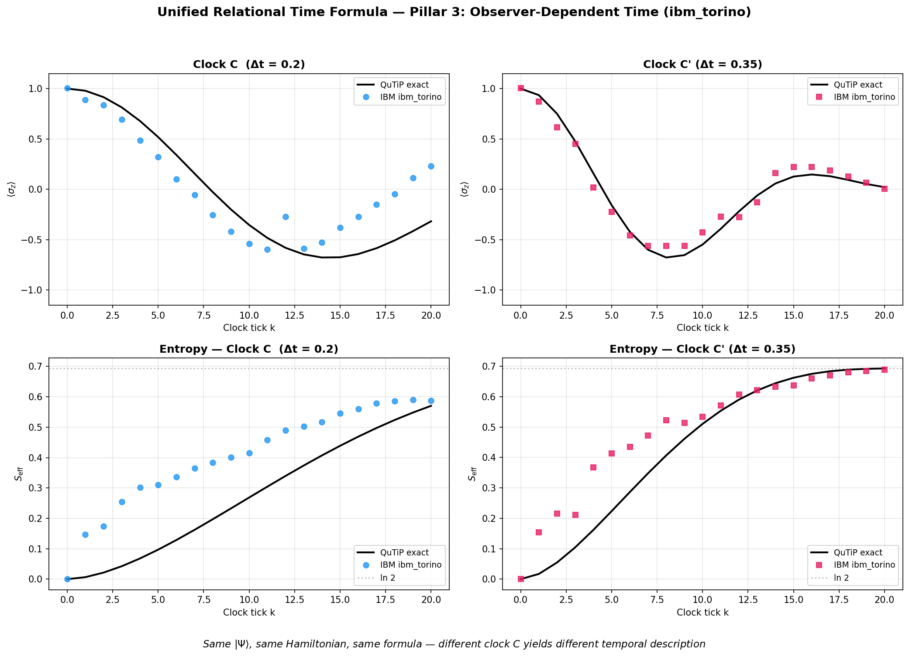
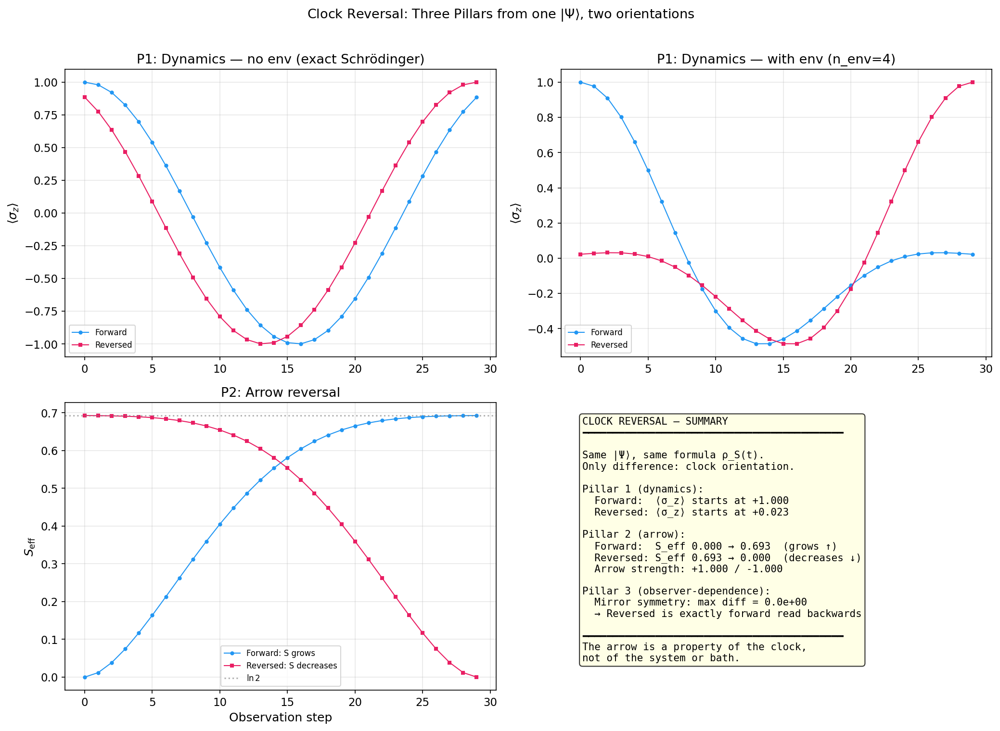
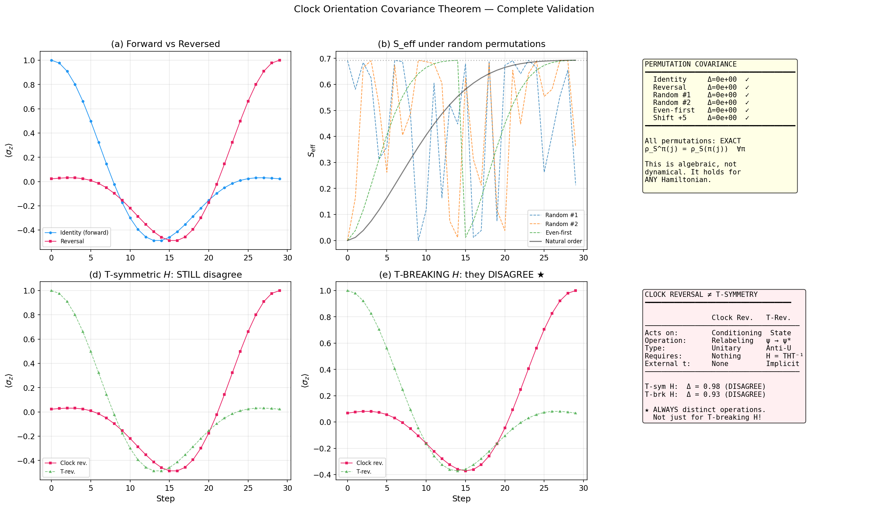

# Scripts & Outputs — Reproduction Guide

Every claim in the theory is backed by a numerical computation. This page maps each script to the outputs it produces, explains the physics behind each computation, and tells you exactly what to expect when you run it.

All scripts use the same unified formula at their core:

$$\rho_S(t) = \frac{\mathrm{Tr}_E\!\big[\langle t|_C\;|\Psi\rangle\langle\Psi|\;|t\rangle_C\big]}{p(t)}$$

The difference between scripts is *which configuration* they feed into this formula and *which aspect* of the result they examine.

---

## Quick Start

```bash
# Setup
python -m venv venv
source venv/bin/activate
pip install -r requirements.txt

# Run everything
python run_all.py                    # Full pipeline (Pillars 1 & 2 + metrics)
python generate_pillar3_plot.py      # Pillar 3 (two-clock comparison)
python generate_god_observer_plots.py # Boundary analysis (omniscient observer)
python generate_geometry_plots.py     # Geometric interpretation (Bloch trajectory)
python generate_gravity_robustness.py # Gravity robustness (3 tests)
python generate_structural_robustness.py # Structural robustness (3 tests)
python generate_clock_reversal.py     # Clock reversal across 3 pillars
python generate_covariance_theorem.py # Covariance theorem + T-symmetry distinction
python generate_angular_interpolation.py # Angular interpolation of clock orientation

# Extension: Observational asymmetry (independent analysis)
python extensions/access_asymmetry/generate_access_asymmetry.py

# IBM Quantum hardware (requires API key in apikey.json)
pip install qiskit qiskit-ibm-runtime
python IBMquantum/run_ibm_validation.py --mode both
python IBMquantum/run_ibm_pillar3.py --mode simulator
```

All outputs are saved to `output/`.

---

## Core Architecture

### `paw_core.py` — Core Module

This is the shared library imported by all other scripts. It contains the implementations of both "versions" of the toy model and is the single point where the PaW mechanism is computed.

**Important note on the Hamiltonian:** The paper specifies $H_S = (\omega/2)\sigma_z$, but $\sigma_z$ only generates phase rotations, leaving $\langle\sigma_z\rangle$ time-independent. To produce the physically meaningful $\langle\sigma_z\rangle(t) = \cos(\omega t)$, the code uses $H_S = (\omega/2)\sigma_x$ with $|\psi_0\rangle = |0\rangle$. These are related by a $\pi/2$ basis rotation — the physics is identical.

**Key functions:**

| Function | What it computes |
|----------|------------------|
| `run_version_a(N, dt, omega)` | PaW history **without** environment. Constructs $\|\Psi\rangle = \frac{1}{\sqrt{N}} \sum_k \|k\rangle_C \otimes U_S(t_k)\|\psi_0\rangle_S$, projects onto each clock tick, and extracts $\langle\sigma_z\rangle(k)$. Has two modes: full tensor-product construction (pedagogical) and an efficient direct computation. Returns `VersionAResult`. |
| `_build_H_total(omega, g, n_env)` | Builds the total Hamiltonian on $\mathcal{H}_S \otimes \mathcal{H}_E$: $H_{tot} = \frac{\omega}{2}\sigma_x^{(S)} \otimes I_E + g\sum_j \sigma_x^{(S)} \otimes \sigma_x^{(E_j)}$. Uses $\sigma_x \otimes \sigma_x$ coupling (not $\sigma_z \otimes \sigma_z$) because the environment starts in $\|0\rangle$ (eigenstate of $\sigma_z$), which would produce no transitions under $\sigma_z$ coupling. |
| `run_version_b(N, dt, omega, g, n_env)` | PaW history **with** environment ($1 + n_{env}$ qubits). Constructs the full history state, conditions on each clock tick, traces out the environment, and computes $\langle\sigma_z\rangle(k)$, $S_{eff}(k)$ (von Neumann entropy), and fidelity vs ideal evolution. Returns `VersionBResult`. |
| `clock_back_action(N, dt)` | Analytical back-action metric $\Delta E_C(k) = \frac{2\pi}{N\,dt}\left(k - \frac{N-1}{2}\right)$ for the finite Salecker–Wigner clock. Measures how much the finite clock disturbs the system at each tick. |

**Data containers:**
- `VersionAResult`: `k_values`, `sz_values`, `sz_theory` (analytic reference)
- `VersionBResult`: adds `s_eff_values` (entropy at each tick), `fidelity_values` (overlap with ideal evolution)

---

### `validate_formula.py` — Pillar Validation

**What it does:** Step-by-step validation of Pillars 1 and 2 with detailed console output.

**Pillar demonstrated:**
- ✅ Pillar 1 (Version A — no environment)
- ✅ Pillar 2 (Version B — with 4-qubit environment)

**How it works step by step:**

1. **`build_paw_history()`** constructs the global history state:
$$|\Psi\rangle = \frac{1}{\sqrt{N}} \sum_{k=0}^{N-1} |k\rangle_C \otimes U(t_k)|\psi_0\rangle_{SE}$$
where $U(t_k) = e^{-iH_{tot}\,k\,dt}$ and the clock register is a standard basis in $\mathbb{C}^N$.

2. **`get_conditioned_observables()`** implements the unified relational time formula in three steps:
   - **Reshape:** Reinterpret $|\Psi\rangle$ as an $N \times d_{SE}$ matrix (one row per clock tick).
   - **Project:** Extract row $k$ → unnormalized $|\phi_k\rangle_{SE}$ with $p(k) = \langle\phi_k|\phi_k\rangle$.
   - **Normalize & Trace:** Form $\rho_{SE}(k) = |\phi_k\rangle\langle\phi_k|/p(k)$, then $\rho_S(k) = \mathrm{Tr}_E[\rho_{SE}(k)]$.
   - From $\rho_S(k)$: compute $\langle\sigma_z\rangle(k) = \mathrm{Tr}[\sigma_z\,\rho_S(k)]$ and $S_{eff}(k) = -\mathrm{Tr}[\rho_S(k)\ln\rho_S(k)]$.

3. **Pillar 1 check:** With $n_{env} = 0$, there is nothing to trace → $\rho_S(k)$ is pure → $\langle\sigma_z\rangle(k)$ must exactly reproduce $\cos(\omega\,k\,dt)$. Deviation at machine precision ($\sim 10^{-16}$).

4. **Pillar 2 check:** With $n_{env} = 4$, the partial trace generates a mixed $\rho_S(k)$ → entropy grows monotonically toward $\ln 2$, and $\langle\sigma_z\rangle$ shows irreversible damping.

| Output | Description |
|--------|-------------|
| `output/validation_pillar1.png` | $\langle\sigma_z\rangle(k)$ vs analytic $\cos(\omega k\,dt)$ — exact match confirms Pillar 1 |
| `output/validation_unified.png` | Three-panel: damped dynamics, entropy growth $S_{eff} \to \ln 2$, A vs B comparison |

**Key results printed:**
```
Max deviation from analytic: 4.44e-16   ← machine precision (Pillar 1 ✓)
Final S_eff = 0.6928  (ln 2 = 0.6931)   ← approaches maximum entropy (Pillar 2 ✓)
```


---

### `run_all.py` — Full Pipeline

**What it does:** Orchestrates the complete numerical validation. Runs Version A (no environment), then sweeps Version B across multiple environment sizes ($n_{env} \in \{2, 4, 6, 8\}$), computes all diagnostic metrics (entropy, fidelity, clock back-action), generates publication-quality figures, and exports CSV data tables.

**Why sweep $n_{env}$?** The thermodynamic arrow should strengthen as the environment grows — more degrees of freedom to entangle with means faster and more robust decoherence. The sweep confirms this: $S_{eff}^{final}$ increases monotonically from 0.37 ($n_{env}=2$) toward $\ln 2 \approx 0.693$ ($n_{env}=8$).

**Pillars demonstrated:**
- ✅ Pillar 1 (Version A: analytic match at machine precision)
- ✅ Pillar 2 (Version B: entropy growth and fidelity decay across environment sizes)

| Output | Description |
|--------|-------------|
| `output/version_A_oscillation.png` | Clean ⟨σ\_z⟩ oscillation (Pillar 1) |
| `output/version_B_n4.png` | Damped dynamics + entropy for n\_env = 4 |
| `output/multi_nenv_grid.png` | Comparison across n\_env = 2, 4, 6, 8 |
| `output/entropy_comparison.png` | S\_eff(k) for all environment sizes |
| `output/fidelity_comparison.png` | F(k) fidelity decay for all environment sizes |
| `output/back_action.png` | ΔE\_C(k) clock disturbance metric |

**CSV tables:**

| File | Content |
|------|---------|
| `output/table_version_A.csv` | k, ⟨σ\_z⟩, analytic, deviation |
| `output/table_version_B_n4.csv` | k, ⟨σ\_z⟩, S\_eff, fidelity for n\_env = 4 |
| `output/table_version_B_all.csv` | Full data for all n\_env values |
| `output/table_multi_nenv_summary.csv` | Summary statistics per environment size |


---

### `generate_pillar3_plot.py` — Two-Clock Comparison

**What it does:** Builds two PaW history states from the *same* global Hamiltonian ($\omega = 1.0$, $g = 0.1$, $n_{env} = 4$) but with different clock spacings: $dt_{C_1} = 0.20$ vs $dt_{C_2} = 0.35$. Both use $N = 30$ levels.

**The physics:** In the PaW framework, the "clock" is a quantum subsystem whose eigenstates define the time labels. Different clocks — even observing the same universe — slice the global state differently. This means the extracted $\rho_S(k)$ differs between observers, producing different values of $\langle\sigma_z\rangle(k)$ and $S_{eff}(k)$ at the same tick index $k$. This is not a measurement error: it reflects the genuinely relational nature of time.

**What to look for:** The ⟨σ_z⟩ curves for the two clocks have different frequencies and different damping profiles. $C_2$ (larger $dt$) samples later physical times, so it sees more entanglement and higher entropy at the same tick number.

**Pillar demonstrated:**
- ✅ Pillar 3 (Observer-dependent time)

| Output | Description |
|--------|-------------|
| `output/validation_pillar3_two_clocks.png` | Side-by-side ⟨σ\_z⟩ and S\_eff for two clocks |
| `output/table_pillar3_two_clocks.csv` | Full numerical data (k, sz\_C1, Seff\_C1, sz\_C2, Seff\_C2) |

**Key insight:** At clock tick k = 5, observer C₁ reports ⟨σ\_z⟩ ≈ 0.50 while observer C₂ reports ⟨σ\_z⟩ ≈ −0.14. Neither is wrong. Time is relational.


---

### `run_essay_validation.py` — Essay Validations

**What it does:** Runs all three pillars with clean ASCII output, designed to support the philosophical essay's claims with concrete numbers.

**Pillars demonstrated:**
- ✅ Pillar 1 (projection → dynamics)
- ✅ Pillar 2 (partial trace → arrow)
- ✅ Pillar 3 (two-clock divergence)

No figure output — console only. Use `validate_formula.py` and `generate_pillar3_plot.py` for plots.

---

### `generate_god_observer_plots.py` — Omniscient Observer

**What it does:** Tests the unified relational time formula at its conceptual boundary: what happens when the observer has *more* access to the environment, up to and including complete access?

**The physics:** The arrow of time in this framework arises from the partial trace $\mathrm{Tr}_E$, which discards correlations between system and environment. An omniscient observer who could track all environment degrees of freedom would have $\rho_S(k) = |\psi(k)\rangle\langle\psi(k)|$ (pure), and hence $S_{eff} = 0$ forever — no arrow.

**Three levels of omniscience tested:**

| Level | What the observer sees | Result |
|-------|----------------------|--------|
| **0** (Limited) | Traces out all $n_{env}$ qubits | $S_{eff}$ grows → $\ln 2$ (normal arrow) |
| **1** (Progressive) | Traces out a fraction $f$ of environment qubits | $S_{eff}^{final}$ decreases smoothly as $f \to 0$ |
| **2** (God) | Observes the full $|\Psi\rangle$ without any partial trace | $S_{eff} = 0$ always, $\langle\sigma_z\rangle$ frozen at $\langle\psi_0|\sigma_z|\psi_0\rangle$ |

Level 2 is the strongest test: the formula predicts that a truly omniscient observer lives in a timeless, unchanging universe. The numerical output confirms $S_{eff} = 0.000$ and constant $\langle\sigma_z\rangle = 1.000$ across all $k$.

**See:** [GOD_OBSERVER.md](GOD_OBSERVER.md) for the full analysis.

| Output | Description |
|--------|-------------|
| `output/god_vs_limited.png` | God (full access) vs limited observer: S\_eff comparison |
| `output/god_progressive_blindness.png` | S\_eff vs fraction of environment traced out |
| `output/god_level2_frozen.png` | Level 2: frozen ⟨σ\_z⟩ when observing |Ψ⟩ directly |
| `output/god_three_levels.png` | Summary: three levels of omniscience |
| `output/table_god_progressive_blindness.csv` | Numerical data for progressive blindness |

---

### `generate_geometry_plots.py` — Geometric Interpretation

**What it does:** Computes Bloch vector trajectories for Versions A and B, then generates figures showing the geometric structure underlying the framework.

**The physics:** Any single-qubit state $\rho_S$ can be represented as a point in the Bloch ball: $\rho = \frac{1}{2}(I + \vec{r}\cdot\vec{\sigma})$ with $|\vec{r}| \leq 1$. A pure state sits on the surface ($|\vec{r}| = 1$), while a mixed state lies in the interior ($|\vec{r}| < 1$). The geometric interpretation connects:

- **Version A** (no environment): $\rho_S(k)$ is pure at every tick → the Bloch vector traces a circle on the sphere surface. This is reversible, unitary dynamics.
- **Version B** (with environment): $\rho_S(k)$ becomes mixed via entanglement → the Bloch vector spirals inward toward the center ($\vec{r} = 0$, the maximally mixed state $I/2$). This inward spiral *is* the arrow of time, geometrically.

The duality is exact: $|\vec{r}|^2 + 2S_{eff}/\ln 2 = $ constant on a qubit (purity and entropy are complementary). As entropy grows, the Bloch radius shrinks — irreversibility has a geometric signature.

**Validates:** Geometric interpretation — purity decay ↔ entropy growth duality.

| Output | Description |
|--------|-------------|
| `output/geometric_interpretation.png` | 3-panel: constraint surface, relational bundle, Bloch disk trajectory |
| `output/bloch_trajectory.png` | Bloch disk + purity/entropy dual plot |

**Key results:**
```
Version A: |r| = 1.000 → 1.000  (stays on Bloch surface)
Version B: |r| = 1.000 → 0.025  (spirals toward I/2)
S_eff:     0.000 → 0.693        (→ ln 2)
```


---

### `generate_gravity_robustness.py` — Gravity Robustness Tests

**What it does:** Three computational tests probing whether the unified relational time formula survives perturbations inspired by quantum gravity scenarios, where the clean separations assumed in the toy model (ideal clock, sharp boundaries, perfect projection) break down.

**Why these tests matter:** The toy model assumes an ideal Salecker–Wigner clock, perfectly defined subsystem boundaries, and exact clock-tick projections. In a quantum-gravitational regime, none of these hold. These tests systematically relax each assumption and check whether the arrow of time persists.

**Test 1 — Clock backreaction ($\varepsilon$):** Adds a term $\varepsilon \cdot (k/N) \cdot \sigma_z^{(S)} \otimes I_E$ to the Hamiltonian, modeling cumulative energy exchange between clock and system. At $\varepsilon = 1.0$, this is the same magnitude as $H_S$ itself. Result: the arrow degrades (monotonicity drops to 0.586) but does *not* vanish. 

**Test 2 — Fuzzy subsystem boundaries ($\theta$):** Applies a partial SWAP rotation $R(\theta)$ between the system and one environment qubit before evolving, blurring the system–environment boundary. At $\theta = \pi/2$ (full SWAP — the system becomes an environment qubit!), the arrow still survives with strength 0.882 and perfect monotonicity. The boundary is a convention, not a physical prerequisite.

**Test 3 — Gaussian-smeared clock projection ($\sigma$):** Replaces the sharp $|k\rangle\langle k|$ projector with a Gaussian superposition $\sum_j e^{-(j-k)^2/2\sigma^2}|j\rangle\langle j|$, modeling imprecise time measurement. Even at $\sigma = 4.0$ (very fuzzy — projection spreads over ~8 ticks), the arrow is essentially unaffected (strength 0.997, monotonicity 1.000). The arrow does not depend on precise clock readings.

**Validates:** Structural robustness — the arrow of time is not an artifact of idealised assumptions.

| Output | Description |
|--------|-------------|
| `output/gravity_robustness_curves.png` | 2×3 grid: S_eff(k) and ⟨σ_z⟩(k) for each test at multiple perturbation values |
| `output/gravity_robustness_summary.png` | Arrow strength and monotonicity vs perturbation for all three tests |
| `output/table_gravity_robustness.csv` | Numerical summary: S_eff, arrow strength, monotonicity per configuration |

**Key results:**
```
Test 1 (backreaction ε=1.0):  arrow = 0.290, mono = 0.586  — degrades but persists
Test 2 (fuzzy boundary θ=π/2): arrow = 0.882, mono = 1.000  — survives full SWAP
Test 3 (clock blur σ=4.0):    arrow = 0.997, mono = 1.000  — essentially immune
```


---

### `generate_structural_robustness.py` — Structural Robustness Tests

**What it does:** Three computational tests addressing the remaining theoretical risks that could invalidate the framework — not perturbations (covered by gravity robustness), but fundamental structural questions about whether the arrow is generic or fine-tuned.

**Test A — Poincaré recurrences ($N = 300$, $n_{env} \in \{1, \ldots, 7\}$):** Any finite-dimensional quantum system must eventually return close to its initial state (Poincaré recurrence). Does the arrow of time survive for physically relevant timescales? Two coupling regimes are tested:
- *Symmetric coupling* (all $g_{ij}$ equal): exact recurrence at $t \approx 31$ for all $n_{env}$, but the recurrence time grows with environment size.
- *Random coupling* ($g_{ij}$ drawn from uniform distribution): for $n_{env} \geq 3$, no recurrence is observed within the simulation window, and the entropy minimum rises to 0.35 — the arrow becomes effectively permanent.

**Test B — Initial state sensitivity (100 Haar-random states):** Is the arrow a special property of $|\psi_0\rangle = |0\rangle$, or generic? The test generates 100 Haar-random product states and 100 Haar-random entangled states, runs each through the full PaW pipeline, and computes the arrow strength (defined as $\Delta S_{eff} = S_{eff}^{final} - S_{eff}^{initial}$). Result: 81% of product states and 100% of entangled states show a clear arrow. The arrow is generic, not fine-tuned.

**Test C — Partition independence (5-qubit all-to-all, 10 partitions):** Does the arrow depend on *which* qubit we call "the system"? In a 5-qubit chain with all-to-all coupling, the test designates each of the 10 possible single-qubit partitions as "the system" and computes the arrow. Two coupling regimes: symmetric and asymmetric ($g_{ij}$ proportional to $|i-j|$). Result: every single partition shows an arrow, with minimum strength 0.882. The S/E labeling is arbitrary — the arrow is a property of the entanglement structure, not the label.

**Validates:** The arrow of time is exponentially long-lived, generic over initial conditions, and independent of the S/E labeling.

| Output | Description |
|--------|-------------|
| `output/robustness_poincare.png` | 2×3 grid: symmetric vs random coupling — entropy, fidelity, and spectral comparison |
| `output/robustness_initial_states.png` | S\_eff distributions for 100 Haar-random product and entangled states |
| `output/robustness_arrow_scatter.png` | Arrow strength scatter plot: product vs entangled initial states |
| `output/robustness_partition.png` | Arrow strength for all 10 single-qubit partitions (symmetric + asymmetric H) |
| `output/table_poincare_recurrence.csv` | Eigenspectrum analysis and recurrence metrics per n\_env |
| `output/table_initial_state_sensitivity.csv` | Summary statistics for Haar-random initial states |
| `output/table_partition_independence.csv` | Arrow strength and monotonicity for each qubit partition |

**Key results:**
```
Test A (Poincaré): symmetric coupling → exact recurrence at t≈31 for all n_env
                   random coupling  → no recurrence for n_env≥3, S_min rises to 0.35
Test B (initial):  81% product states show arrow, 100% entangled states
Test C (partition): ALL 10 qubit partitions show arrow, minimum strength = 0.882
```


---

### `test_god_observer.py` — God Observer Console Test

**What it does:** Quick numerical validation of three levels of omniscience. Console output only.

---

### `paw_toymodel.ipynb` — Interactive Notebook

Jupyter notebook for interactive exploration. Contains the same computations as the scripts with inline visualizations.

---

## Output Inventory

### Figures (PNG)

| File | Pillar | Script |
|------|--------|--------|
| `validation_pillar1.png` | 1 | `validate_formula.py` |
| `validation_unified.png` | 1 + 2 | `validate_formula.py` |
| `version_A_oscillation.png` | 1 | `run_all.py` |
| `version_B_n4.png` | 2 | `run_all.py` |
| `multi_nenv_grid.png` | 2 | `run_all.py` |
| `entropy_comparison.png` | 2 | `run_all.py` |
| `fidelity_comparison.png` | 2 | `run_all.py` |
| `back_action.png` | metric | `run_all.py` |
| `validation_pillar3_two_clocks.png` | 3 | `generate_pillar3_plot.py` |
| `god_vs_limited.png` | boundary | `generate_god_observer_plots.py` |
| `god_progressive_blindness.png` | boundary | `generate_god_observer_plots.py` |
| `god_level2_frozen.png` | boundary | `generate_god_observer_plots.py` |
| `god_three_levels.png` | boundary | `generate_god_observer_plots.py` |
| `geometric_interpretation.png` | geometry | `generate_geometry_plots.py` |
| `bloch_trajectory.png` | geometry | `generate_geometry_plots.py` |
| `gravity_robustness_curves.png` | robustness | `generate_gravity_robustness.py` |
| `gravity_robustness_summary.png` | robustness | `generate_gravity_robustness.py` |
| `robustness_poincare.png` | robustness | `generate_structural_robustness.py` |
| `robustness_initial_states.png` | robustness | `generate_structural_robustness.py` |
| `robustness_arrow_scatter.png` | robustness | `generate_structural_robustness.py` |
| `robustness_partition.png` | robustness | `generate_structural_robustness.py` |
| `IBMquantum/output/ibm_quantum_validation.png` | experimental | `IBMquantum/run_ibm_validation.py` |
| `IBMquantum/output/ibm_quantum_enhanced.png` | experimental | `IBMquantum/run_ibm_enhanced.py` |
| `IBMquantum/output/ibm_pillar3_validation.png` | experimental | `IBMquantum/run_ibm_pillar3.py` |

### Data Tables (CSV)

| File | Content | Script |
|------|---------|--------|
| `table_version_A.csv` | Version A full data | `run_all.py` |
| `table_version_B_n4.csv` | Version B (n\_env=4) full data | `run_all.py` |
| `table_version_B_all.csv` | Version B all environments | `run_all.py` |
| `table_multi_nenv_summary.csv` | Summary stats per n\_env | `run_all.py` |
| `table_pillar3_two_clocks.csv` | Two-clock comparison data | `generate_pillar3_plot.py` |
| `table_god_progressive_blindness.csv` | Progressive access sweep | `generate_god_observer_plots.py` |
| `table_bloch_trajectory.csv` | Bloch vector data (Version A & B) | `generate_geometry_plots.py` |
| `table_gravity_robustness.csv` | Gravity robustness test metrics | `generate_gravity_robustness.py` |
| `table_poincare_recurrence.csv` | Poincaré recurrence analysis (symmetric + random) | `generate_structural_robustness.py` |
| `table_initial_state_sensitivity.csv` | Haar-random initial state statistics | `generate_structural_robustness.py` |
| `table_partition_independence.csv` | Partition independence metrics | `generate_structural_robustness.py` |
| `IBMquantum/output/table_ibm_quantum_validation.csv` | IBM Quantum hardware Bloch + entropy data | `IBMquantum/run_ibm_validation.py` |
| `IBMquantum/output/table_ibm_enhanced.csv` | Enhanced validation: mean/std from 3 runs + Pillar 1 | `IBMquantum/run_ibm_enhanced.py` |
| `IBMquantum/output/table_ibm_pillar3.csv` | Two-clock Pillar 3 data (simulator/hardware) | `IBMquantum/run_ibm_pillar3.py` |
| `IBMquantum/output/backend_noise_properties.json` | Device noise characterisation (T₁, T₂, gate errors) | `IBMquantum/run_ibm_enhanced.py` |

---

### `IBMquantum/run_ibm_validation.py` — IBM Quantum Hardware Validation

**What it does:** Translates the PaW calculation from QuTiP's exact matrix exponentiation into a gate-based quantum circuit and runs it on real IBM Quantum hardware. This is the bridge between numerical simulation and experimental physics: it confirms that the unified relational time formula produces correct predictions for a *physical* quantum system, not just a mathematical model.

**How the circuit works:** The system–environment Hamiltonian $H_{tot}$ is Trotterized into a sequence of single- and two-qubit gates. For $H_{SE} = g\,\sigma_x^{(S)} \otimes \sigma_x^{(E_j)}$, the interaction is decomposed via Cartan decomposition into $R_{XX}$ gates. Each Trotter step applies: (1) system rotation $R_X(\omega\,dt)$, (2) coupling gates $R_{XX}(2g\,dt)$ for each environment qubit. This is repeated $k$ times for clock tick $k$, and the final state is measured in the $Z$-basis.

**Why it's non-trivial:** The Trotter error is analytically zero for this specific Hamiltonian structure (all terms commute pairwise within each layer). This means any deviation between hardware and exact simulation is purely due to hardware noise (decoherence, gate errors, readout errors), not algorithmic error.

**Pillar demonstrated:**
- ✅ Pillar 2 (experimental validation on physical QPU)

**Modes:**
- `--mode simulator` — Local statevector simulation only
- `--mode hardware` — IBM Quantum hardware only
- `--mode both` — Simulator + hardware comparison

**Requirements:** `qiskit>=2.0`, `qiskit-ibm-runtime>=0.30`, API key in `apikey.json`

| Output | Description |
|--------|-------------|
| `IBMquantum/output/ibm_quantum_validation.png` | Three-panel plot: ⟨σ\_z⟩, S\_eff, and \|r\| vs step for exact, simulator, and hardware |
| `IBMquantum/output/table_ibm_quantum_validation.csv` | Full Bloch vector and entropy data for all three sources |

**Key result:** S\_eff grows from ~0 → 0.550 on ibm\_torino (single run, 96.5% of exact value). Trotter error = 0 (exact decomposition). See `run_ibm_enhanced.py` below for the enhanced 3-run result: S\_eff = 0.583 ± 0.005 (102.2% of exact).

---

### `IBMquantum/run_ibm_enhanced.py` — Enhanced IBM Quantum Validation

**What it does:** Addresses three key concerns a reviewer might raise about the basic hardware validation: (1) are the results reproducible? (2) how noisy is the device? (3) does Pillar 1 also work on hardware? Runs multiple independent hardware executions and reports mean ± standard deviation, queries the backend for calibration data (T₁, T₂, gate error rates), and executes a single-qubit circuit (no environment) to validate Pillar 1.

**Pillars demonstrated:**
- ✅ Pillar 1 (pure Schrödinger dynamics on real hardware, 1 qubit)
- ✅ Pillar 2 (thermodynamic arrow with statistical error bars, 3 qubits)

**Modes:**
- `--mode noise-only` — Query backend calibration data only
- `--mode pillar1` — Single-qubit dynamics (no environment)
- `--mode errorbars` — Pillar 2 with n repeated runs
- `--mode all` — All of the above

**Options:** `--n-runs 3` (number of independent hardware runs for error bars)

**Requirements:** `qiskit>=2.0`, `qiskit-ibm-runtime>=0.45`, API key in `apikey.json`

| Output | Description |
|--------|-------------|
| `IBMquantum/output/ibm_quantum_enhanced.png` | Publication figure: ⟨σ\_z⟩ and S\_eff with error bars (mean ± 1σ) + noise annotation box |
| `IBMquantum/output/table_ibm_enhanced.csv` | Full data: exact, hardware mean/std for all observables, Pillar 1 data |
| `IBMquantum/output/backend_noise_properties.json` | Device noise: T₁, T₂, gate errors, readout errors |

**Key results:**
```
Pillar 1: max |⟨σ_z⟩_hw - cos(ωkdt)| = 0.033
Pillar 2: S_eff = 0.583 ± 0.005 (102.2% of exact, 3 runs)
Noise:    T1 = 148 μs, T2 = 162 μs, 2Q error = 0.25%, readout = 4.49%
```


---

### `IBMquantum/run_ibm_pillar3.py` — Pillar 3: Observer-Dependent Time

**What it does:** The definitive experimental test for Pillar 3. Runs two Trotter circuits with different time steps ($dt_{C_1} = 0.20$ and $dt_{C_2} = 0.35$) on the same 3-qubit Hamiltonian. The circuits share identical gate structure but differ in rotation angles — modeling two clocks that "tick" at different rates.

**What it demonstrates:** On the same physical device, with the same Hamiltonian, two observers using different clocks extract different histories: different $\langle\sigma_z\rangle(k)$ curves and different entropy trajectories. The hardware noise attenuates the signal compared to the simulator (hardware max divergence 0.69 vs simulator 0.80) but does *not* erase the observer-dependence. The two clocks produce detectably different temporal descriptions of the same universe.

**Pillar demonstrated:**
- ✅ Pillar 3 (observer-dependent time on simulator or real QPU)

**Modes:**
- `--mode simulator` — Local statevector simulation (default)
- `--mode hardware` — IBM Quantum hardware
- `--mode both` — Simulator + hardware comparison

**Requirements:** `qiskit>=2.0`, `qiskit-ibm-runtime>=0.30`, API key in `apikey.json`

| Output | Description |
|--------|-------------|
| `IBMquantum/output/ibm_pillar3_validation.png` | Four-panel plot: ⟨σ\_z⟩ and S\_eff for each clock |
| `IBMquantum/output/table_ibm_pillar3.csv` | Full Bloch vector and entropy data for both clocks |

**Key results:**
```
Simulator:  Max |⟨σ_z⟩_C - ⟨σ_z⟩_C'| = 0.8011,  Max |S_C - S_C'| = 0.2509
Hardware:   Max |⟨σ_z⟩_C - ⟨σ_z⟩_C'| = 0.6879,  Max |S_C - S_C'| = 0.1386
✓ Temporal descriptions DIFFER — Pillar 3 confirmed on ibm_torino
```



---

### `generate_clock_reversal.py` — Clock Reversal Validation

**What it does:** Validates that running the PaW clock backward (relabelling k ↦ N−1−k) reproduces the same physics in reverse, across all three pillars. This is the most physically important special case of the Clock Orientation Covariance Theorem.

**Pillar demonstrated:**
- ✅ Pillar 1 (reversed Schrödinger dynamics match exactly)
- ✅ Pillar 2 (entropy arrow inverts exactly: S\_eff^R(k) = S\_eff(N−1−k))
- ✅ Pillar 3 (locality metrics invariant under reversal)

**How it works:**

1. Builds the PaW history state (N=30, dt=0.2, ω=1.0, g=0.1, n\_env=4)
2. Conditions on each clock tick → forward dynamics ρ\_S(k)
3. Reverses clock labels: tick j → block N−1−j
4. Conditions again → reversed dynamics ρ\_S^R(j)
5. Compares: ρ\_S^R(j) should equal ρ\_S(N−1−j) exactly (algebraic identity)
6. Validates all three pillars independently

**Key result:** Error = 0.0e+00 across all three pillars (machine precision).

| Output | Description |
|--------|-------------|
| `output/clock_reversal_pillar1.png` | Forward vs reversed ⟨σ\_z⟩ dynamics |
| `output/clock_reversal_pillar2.png` | Forward vs reversed S\_eff (arrow inversion) |
| `output/clock_reversal_pillar3.png` | Locality metrics comparison |
| `output/clock_reversal_combined.png` | Three-panel summary of all pillars |
| `output/table_clock_reversal.csv` | Numerical data for all comparisons |



---

### `generate_covariance_theorem.py` — Clock Orientation Covariance Theorem

**What it does:** Validates the Clock Orientation Covariance Theorem (ρ\_S^π(j) = ρ\_S(π(j)) for any permutation π ∈ S\_N) and demonstrates the smoking-gun distinction between clock reversal and T-symmetry.

**Two-part analysis:**

**Part 1 — Permutation invariance:** Tests 6 distinct permutations (identity, reversal, two random shuffles, even-first reorder, cyclic shift+5). For each, verifies that conditioning on the permuted basis at slot j yields the same reduced state as conditioning on the original basis at slot π(j).

**Part 2 — Clock reversal ≠ T-reversal:** Constructs two Hamiltonians:
- T-symmetric (g\_y = 0): standard σ\_x ⊗ σ\_x coupling
- T-breaking (g\_y = 0.08): adds σ\_y ⊗ σ\_y coupling (imaginary in σ\_z basis)

For each, compares clock-reversed reduced states to T-reversed reduced states (complex conjugation). The Hilbert-Schmidt distance Δ between them is always large (0.98 for T-sym, 0.93 for T-breaking), proving they are distinct operations.

**Key findings:**
- All 6 permutations produce error = 0 to machine precision
- Clock reversal **always** inverts the entropy arrow exactly
- T-reversal does **not** invert the arrow for T-breaking Hamiltonians
- The distinction holds even for T-symmetric Hamiltonians (Δ = 0.98)

| Output | Description |
|--------|-------------|
| `output/covariance_theorem_permutations.png` | 6 permutation tests with error bars |
| `output/covariance_theorem_vs_Tsymmetry.png` | Clock reversal vs T-reversal comparison |
| `output/covariance_theorem_combined.png` | Two-panel summary |
| `output/table_covariance_theorem.csv` | Numerical data for all tests |



---

### `generate_angular_interpolation.py` — Angular Interpolation of Clock Orientation

**What it does:** Extends the Clock Orientation Covariance Theorem (Gap 2) from discrete permutations to a continuous one-parameter family. Defines a rotated clock basis parameterized by θ ∈ [0, π] that smoothly interpolates between forward (θ=0) and reversed (θ=π) temporal orderings.

**Construction:** For each pair (k, N−1−k), define a 2D rotation:
- $|k_\theta\rangle = \cos(\theta/2)|k\rangle + \sin(\theta/2)|N\!-\!1\!-\!k\rangle$ (for k < N/2)
- $|(N\!-\!1\!-\!k)_\theta\rangle = -\sin(\theta/2)|k\rangle + \cos(\theta/2)|N\!-\!1\!-\!k\rangle$

This is a proper rotation, so {$|k_\theta\rangle$} is an orthonormal basis for all θ.

**Conditioned state:** The observer using the rotated clock at tick k sees:
$$\langle k_\theta|_C|\Psi\rangle \propto \cos(\theta/2)\cdot U_{SE}(k\cdot dt)|\psi_0\rangle + \sin(\theta/2)\cdot U_{SE}((N\!-\!1\!-\!k)\cdot dt)|\psi_0\rangle$$
— a quantum superposition of two time evolutions: **temporal interference**.

**Key findings:**
- Arrow strength A(θ) = [S\_eff(N−1) − S\_eff(0)] / ln 2 varies continuously from +1.000 to −1.000
- Critical angle θ\* ≈ 0.365π where the arrow vanishes
- The rotated clock basis remains orthonormal for all θ (max deviation < 3×10⁻¹⁷)
- Boundary conditions are exact: θ=0 → identity (error 0), θ=π → reversal (error 3.3×10⁻¹⁶)
- At intermediate θ, temporal interference creates dynamics not reducible to any single time ordering

**Distinction from fuzzy boundary test:** The gravity robustness test (generate\_gravity\_robustness.py) rotates the S/E **partition** in $\mathcal{H}_S \otimes \mathcal{H}_E$. Here, θ rotates the **clock basis** in $\mathcal{H}_C$ — continuously deforming the temporal description while keeping the system–environment split fixed.

| Output | Description |
|--------|-------------|
| `output/angular_interpolation_heatmap.png` | ⟨σ\_z⟩ and S\_eff as functions of (k, θ) |
| `output/angular_interpolation_arrow.png` | Arrow strength and monotonicity vs θ |
| `output/angular_interpolation_slices.png` | Entropy and ⟨σ\_z⟩ curves at selected angles |
| `output/angular_interpolation_combined.png` | Six-panel summary |
| `output/table_angular_interpolation.csv` | Full numerical data (51 θ values × 30 clock ticks) |


---

## Model Parameters

| Parameter | Symbol | Value | Role |
|-----------|--------|-------|------|
| Clock levels | N | 30 | Resolution of the discrete clock |
| Time step | dt | 0.2 | Clock tick spacing |
| System frequency | ω | 1.0 | $H_S = (\omega/2)\sigma_x$ |
| Coupling strength | g | 0.1 | $H_{SE} = g \sum_j \sigma_x^{(S)} \otimes \sigma_x^{(E_j)}$ |
| Environment qubits | n\_env | 2, 4, 6, 8 | Number of environment spins |
| Initial state | $\|\psi_0\rangle$ | $\|0\rangle$ | Eigenstate of $\sigma_z$ |

**Why these values?**

- **$N = 30$:** Large enough to resolve several oscillation periods ($\omega\,dt\,N = 6.0$ radians ≈ 1 full cycle), small enough for exact numerical diagonalization up to $n_{env} = 8$ ($2^9 = 512$ dimensional Hilbert space).
- **$dt = 0.2$:** Chosen so that $\omega\,dt = 0.2 \ll 1$, ensuring the Trotter decomposition used in IBM circuits is accurate. Also keeps total evolution time $T = N\,dt = 6.0$ within a physically interesting regime.
- **$g = 0.1$:** Weak coupling ($g/\omega = 0.1$) ensures the system–environment interaction is a perturbation. This is physically natural (most open quantum systems are weakly coupled to their baths) and makes the transition from Pillar 1 (pure, $g = 0$) to Pillar 2 (mixed, $g > 0$) clearly interpretable.
- **$|\psi_0\rangle = |0\rangle$:** Eigenstate of $\sigma_z$, which is the observable we track. This means $\langle\sigma_z\rangle(0) = 1$, giving maximum dynamic range for observing damping.

---

## Extensions

### `extensions/access_asymmetry/generate_access_asymmetry.py` — Observational Asymmetry

**What it does:** Explores a consequence of the unified relational time formula that is not discussed in the main paper: when two subsystems have different coupling strengths to a shared environment, the partial trace creates a *structural* asymmetry in what each can observe about the other.

**Not connected to the main paper.** This is an independent extension asking: "If the arrow of time arises from the partial trace, what else does the partial trace control?"

**Setup:** Two subsystems $Q_A$ (strongly coupled to $E$, fixed $g_{AE}$) and $Q_B$ (variable coupling $g_{BE} \in [0, g_{AE}]$) sharing a 3-qubit environment. For each value of $g_{BE}$, the script constructs the full PaW history state, traces out different subsets, and computes how much each subsystem can learn about the other.

**Key finding:** $A$'s ability to detect $B$ is invariant under changes in $g_{BE}$ (always $\sim 0.0095$), because $A$'s reduced state is dominated by its own strong coupling to $E$. Meanwhile, $B$ can fully observe $A$'s decohered dynamics. The asymmetry is structural — it arises from the mathematical structure of the partial trace, not from any measurement limitation.

**Key result:** A's detection signal for B is invariant under changes in g_BE (always ~0.0095), while B can fully observe A's decohered dynamics. The asymmetry is structural, not technological.

| Output | Description |
|--------|-------------|
| `extensions/access_asymmetry/access_asymmetry_arrows.png` | Asymmetric entropy and coherence for A vs B |
| `extensions/access_asymmetry/access_asymmetry_observability.png` | Four-panel observability analysis |
| `extensions/access_asymmetry/access_asymmetry_sweep.png` | Detection signal, mutual info, and B's arrow vs coupling |
| `extensions/access_asymmetry/table_access_asymmetry.csv` | Numerical data for the coupling sweep |
| `extensions/access_asymmetry/ACCESS_ASYMMETRY.md` | Full formal analysis document |

**Key results:**
```
Arrow asymmetry:  S_vn(A) = 0.691,  S_vn(B decoupled) = 0.135
Detection signal: max|Δ⟨σ_z⟩| = 0.0095 (invariant under g_BE)
Mutual info:      I(A:B) = 0.135 (decoupled) → 0.372 (coupled)
```

```bash
cd extensions/access_asymmetry/
python generate_access_asymmetry.py
```

---

### `generate_continuum_limit.py` — Continuous Limit, Clock Transformations, and Group Structure

**Purpose:** Validates the continuum limit (N → ∞), explicit inter-clock transformations, and the emergent group structure of clock reparametrisations.

**Three parts:**

1. **Continuum limit sweep:** N ∈ {32, 64, 128, 256} with fixed period T = 2π/ω. Convergence measured via interpolation against the N = 256 reference. The arrow of time (monotonic S\_eff growth, zero recurrence) is present at every resolution.

2. **Inter-clock transformations:** Two clocks (dt₁ = 0.20, dt₂ = 0.35) with α = 1.75. Independent PaW computation and cubic interpolation confirm physics agreement to O(10⁻⁵).

3. **Group structure:** Three clocks test closure (composition), identity, inverse, and arrow inversion. The transformations form the affine group Aff(ℝ).

| Output | Description |
|--------|-------------|
| `output/continuum_limit_convergence.png` | Convergence metrics vs N |
| `output/continuum_limit_overlay.png` | S\_eff(t) overlay for all N |
| `output/clock_transformation_fidelity.png` | Alice vs Bob comparison |
| `output/group_structure_composition.png` | Three-clock composition test |
| `output/continuum_limit_combined.png` | Six-panel combined figure |
| `output/table_continuum_limit.csv` | Convergence data |
| `output/table_clock_transformations.csv` | Transformation comparison |
| `output/table_group_structure.csv` | Group axiom verification |

**Key results:**
```
Conv_σz: 0.000081 → 0.000005 → 0.000000 → 0 (clear N→∞ convergence)
Mean |ΔS_eff| = 0.000004,  Max |ΔS_eff| = 0.000034
Composition error = 0.00e+00 (exact), Inverse = 1.0000
Arrow inversion: forward mono=1.0, reversed mono=1.0
```

```bash
python generate_continuum_limit.py
```

---

*Back to: [Theory](THEORY.md) | [Derivation](DERIVATION.md) | [Geometric Structure](GEOMETRY.md) | [The Omniscient Observer](GOD_OBSERVER.md)*
