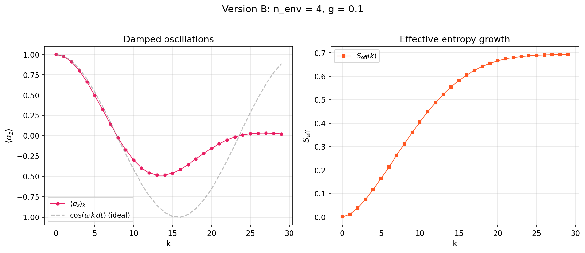
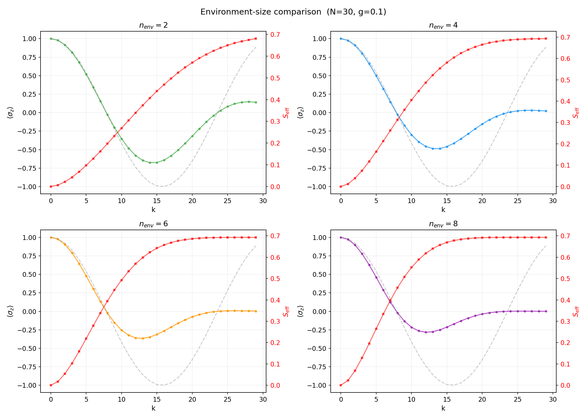
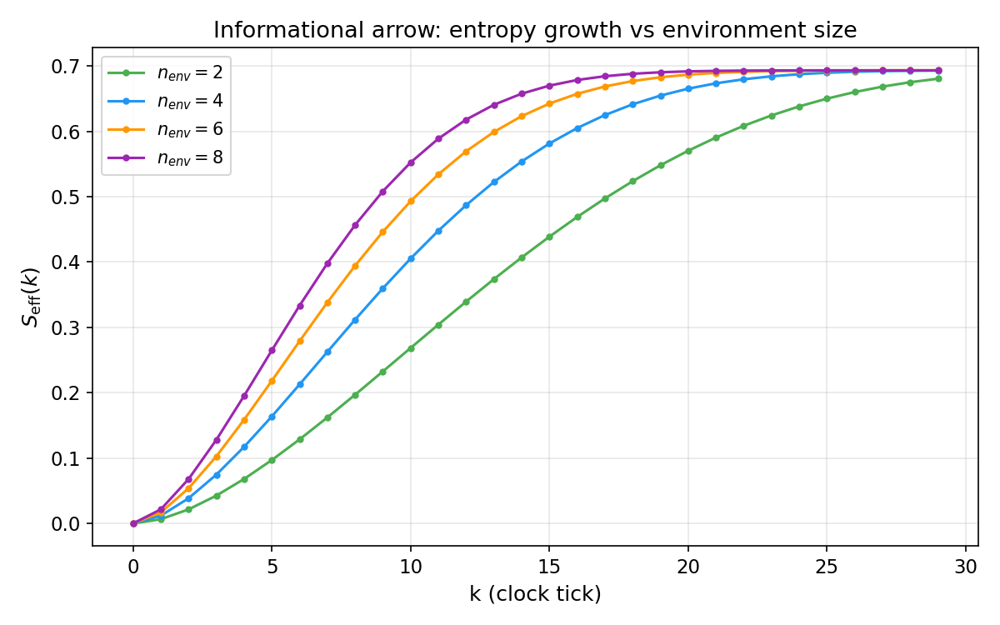
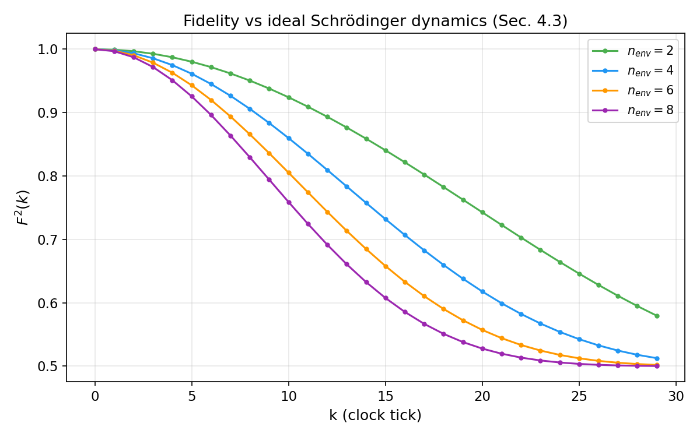
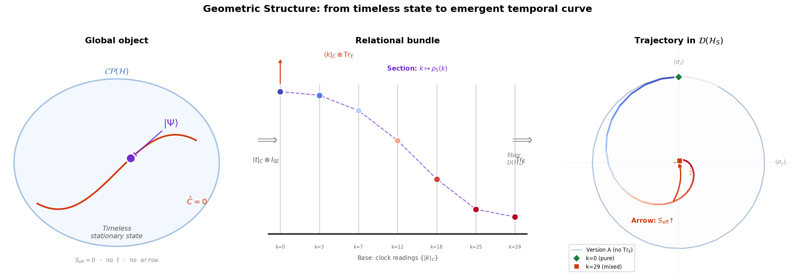
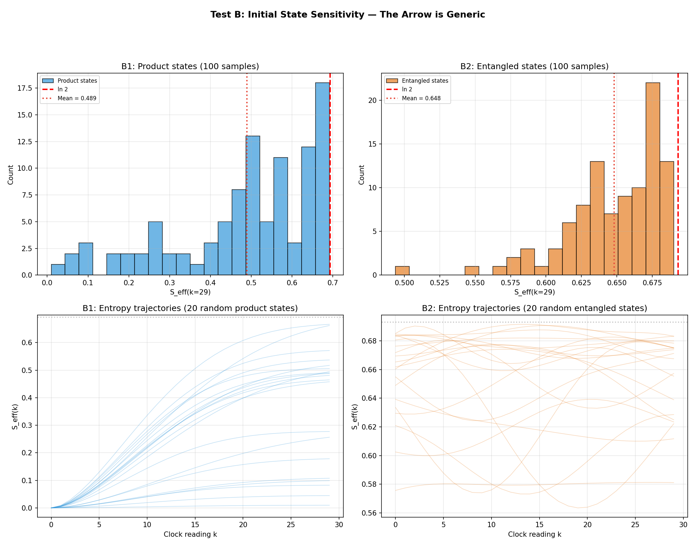
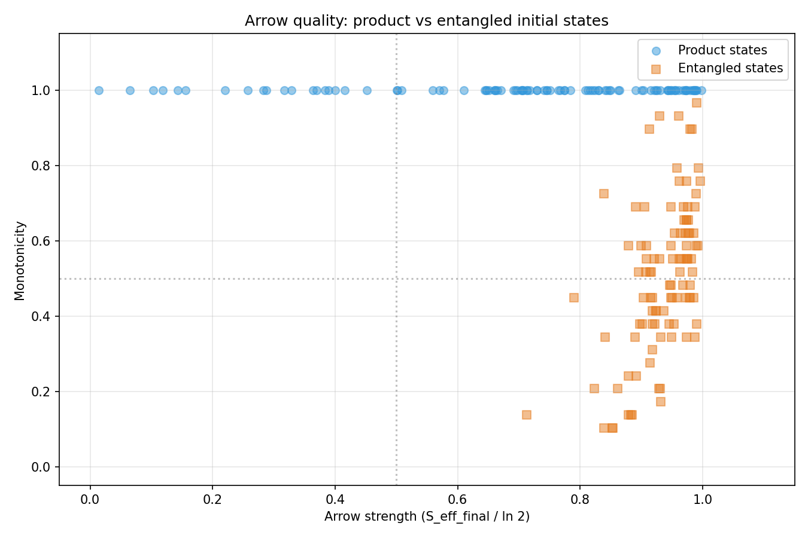
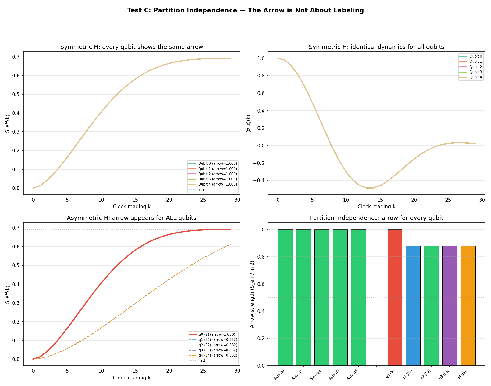

# Scripts & Outputs — Reproduction Guide

Every claim in the theory is backed by a numerical computation. This page maps each script to the outputs it produces and the pillar it validates.

---

## Quick Start

```bash
# Setup
python -m venv venv
source venv/bin/activate
pip install -r requirements.txt

# Run everything
python run_all.py                    # Full pipeline (Pillars 1 & 2 + metrics)
python generate_pillar3_plot.py      # Pillar 3 (two-clock comparison)
python generate_god_observer_plots.py # Boundary analysis (omniscient observer)
python generate_geometry_plots.py     # Geometric interpretation (Bloch trajectory)
python generate_gravity_robustness.py # Gravity robustness (3 tests)
python generate_structural_robustness.py # Structural robustness (3 tests)

# IBM Quantum hardware (requires API key in apikey.json)
pip install qiskit qiskit-ibm-runtime
python IBMquantum/run_ibm_validation.py --mode both
```

All outputs are saved to `output/`.

---

## Script-by-Script Guide

### `paw_core.py` — Core Module

Shared library imported by all other scripts. Contains:
- `build_paw_history(N, dt, omega, initial_S, n_env, g)` — Constructs the history state |Ψ⟩
- `get_conditioned_observables(psi, N, n_env)` — Implements the three-step formula: project → normalize → trace

This is the single function that produces all three pillars depending on configuration.

---

### `validate_formula.py` — Pillar Validation

**What it does:** Step-by-step validation of Pillars 1 and 2 with detailed console output.

**Pillar demonstrated:**
- ✅ Pillar 1 (Version A — no environment)
- ✅ Pillar 2 (Version B — with 4-qubit environment)

| Output | Description |
|--------|-------------|
| `output/validation_pillar1.png` | ⟨σ\_z⟩(k) vs analytic cos(ωkdt) — exact match |
| `output/validation_unified.png` | Three-panel: damped dynamics, entropy growth, A vs B comparison |

**Key results printed:**
```
Max deviation from analytic: 4.44e-16
Final S_eff = 0.6928  (ln 2 = 0.6931)
```


---

### `run_all.py` — Full Pipeline

**What it does:** Runs both versions, sweeps environment sizes (n\_env ∈ {2, 4, 6, 8}), computes all diagnostic metrics, and exports CSV data tables.

**Pillars demonstrated:**
- ✅ Pillar 1 (Version A)
- ✅ Pillar 2 (Version B, multi-environment sweep)

| Output | Description |
|--------|-------------|
| `output/version_A_oscillation.png` | Clean ⟨σ\_z⟩ oscillation (Pillar 1) |
| `output/version_B_n4.png` | Damped dynamics + entropy for n\_env = 4 |
| `output/multi_nenv_grid.png` | Comparison across n\_env = 2, 4, 6, 8 |
| `output/entropy_comparison.png` | S\_eff(k) for all environment sizes |
| `output/fidelity_comparison.png` | F(k) fidelity decay for all environment sizes |
| `output/back_action.png` | ΔE\_C(k) clock disturbance metric |

**CSV tables:**

| File | Content |
|------|---------|
| `output/table_version_A.csv` | k, ⟨σ\_z⟩, analytic, deviation |
| `output/table_version_B_n4.csv` | k, ⟨σ\_z⟩, S\_eff, fidelity for n\_env = 4 |
| `output/table_version_B_all.csv` | Full data for all n\_env values |
| `output/table_multi_nenv_summary.csv` | Summary statistics per environment size |











---

### `generate_pillar3_plot.py` — Two-Clock Comparison

**What it does:** Builds two history states from the same global configuration but with different clock spacings (dt = 0.20 vs dt = 0.35). Compares the temporal narratives.

**Pillar demonstrated:**
- ✅ Pillar 3 (Observer-dependent time)

| Output | Description |
|--------|-------------|
| `output/validation_pillar3_two_clocks.png` | Side-by-side ⟨σ\_z⟩ and S\_eff for two clocks |
| `output/table_pillar3_two_clocks.csv` | Full numerical data (k, sz\_C1, Seff\_C1, sz\_C2, Seff\_C2) |

**Key insight:** At clock tick k = 5, observer C₁ reports ⟨σ\_z⟩ ≈ 0.50 while observer C₂ reports ⟨σ\_z⟩ ≈ −0.14. Neither is wrong. Time is relational.


---

### `run_essay_validation.py` — Essay Validations

**What it does:** Runs all three pillars with clean ASCII output, designed to support the philosophical essay's claims with concrete numbers.

**Pillars demonstrated:**
- ✅ Pillar 1 (projection → dynamics)
- ✅ Pillar 2 (partial trace → arrow)
- ✅ Pillar 3 (two-clock divergence)

No figure output — console only. Use `validate_formula.py` and `generate_pillar3_plot.py` for plots.

---

### `generate_god_observer_plots.py` — Omniscient Observer

**What it does:** Tests the formula at its boundary: what happens when the observer has progressively more access to the environment?

**See:** [GOD_OBSERVER.md](GOD_OBSERVER.md) for the full analysis.

| Output | Description |
|--------|-------------|
| `output/god_vs_limited.png` | God (full access) vs limited observer: S\_eff comparison |
| `output/god_progressive_blindness.png` | S\_eff vs fraction of environment traced out |
| `output/god_level2_frozen.png` | Level 2: frozen ⟨σ\_z⟩ when observing |Ψ⟩ directly |
| `output/god_three_levels.png` | Summary: three levels of omniscience |
| `output/table_god_progressive_blindness.csv` | Numerical data for progressive blindness |

---

### `generate_geometry_plots.py` — Geometric Interpretation

**What it does:** Computes Bloch vector trajectories for Version A and B, then generates two figures showing the geometric structure underlying the framework: the timeless global state, the relational bundle, and the Bloch trajectory spiraling inward.

**Validates:** Geometric interpretation — purity decay ↔ entropy growth duality.

| Output | Description |
|--------|-------------|
| `output/geometric_interpretation.png` | 3-panel: constraint surface, relational bundle, Bloch disk trajectory |
| `output/bloch_trajectory.png` | Bloch disk + purity/entropy dual plot |

**Key results:**
```
Version A: |r| = 1.000 → 1.000  (stays on Bloch surface)
Version B: |r| = 1.000 → 0.025  (spirals toward I/2)
S_eff:     0.000 → 0.693        (→ ln 2)
```




---

### `generate_gravity_robustness.py` — Gravity Robustness Tests

**What it does:** Three computational tests probing whether the unified relational formula is robust against perturbations that mimic aspects of quantum gravity: (1) clock backreaction, (2) fuzzy subsystem boundaries, (3) Gaussian-smeared clock projection.

**Validates:** Structural robustness — the arrow of time is not an artifact of idealised assumptions.

| Output | Description |
|--------|-------------|
| `output/gravity_robustness_curves.png` | 2×3 grid: S_eff(k) and ⟨σ_z⟩(k) for each test at multiple perturbation values |
| `output/gravity_robustness_summary.png` | Arrow strength and monotonicity vs perturbation for all three tests |
| `output/table_gravity_robustness.csv` | Numerical summary: S_eff, arrow strength, monotonicity per configuration |

**Key results:**
```
Test 1 (backreaction ε=1.0):  arrow = 0.290, mono = 0.586  — degrades but persists
Test 2 (fuzzy boundary θ=π/2): arrow = 0.882, mono = 1.000  — survives full SWAP
Test 3 (clock blur σ=4.0):    arrow = 0.997, mono = 1.000  — essentially immune
```


---

### `generate_structural_robustness.py` — Structural Robustness Tests

**What it does:** Three computational tests addressing the remaining computable theoretical risks: Poincaré recurrences, initial state sensitivity, and partition arbitrariness.

**Validates:** The arrow of time is exponentially long-lived, generic over initial conditions, and independent of the S/E labeling.

| Output | Description |
|--------|-------------|
| `output/robustness_poincare.png` | 2×3 grid: symmetric vs random coupling — entropy, fidelity, and spectral comparison |
| `output/robustness_initial_states.png` | S\_eff distributions for 100 Haar-random product and entangled states |
| `output/robustness_arrow_scatter.png` | Arrow strength scatter plot: product vs entangled initial states |
| `output/robustness_partition.png` | Arrow strength for all 10 single-qubit partitions (symmetric + asymmetric H) |
| `output/table_poincare_recurrence.csv` | Eigenspectrum analysis and recurrence metrics per n\_env |
| `output/table_initial_state_sensitivity.csv` | Summary statistics for Haar-random initial states |
| `output/table_partition_independence.csv` | Arrow strength and monotonicity for each qubit partition |

**Key results:**
```
Test A (Poincaré): symmetric coupling → exact recurrence at t≈31 for all n_env
                   random coupling  → no recurrence for n_env≥3, S_min rises to 0.35
Test B (initial):  81% product states show arrow, 100% entangled states
Test C (partition): ALL 10 qubit partitions show arrow, minimum strength = 0.882
```








---

### `test_god_observer.py` — God Observer Console Test

**What it does:** Quick numerical validation of three levels of omniscience. Console output only.

---

### `paw_toymodel.ipynb` — Interactive Notebook

Jupyter notebook for interactive exploration. Contains the same computations as the scripts with inline visualizations.

---

## Output Inventory

### Figures (PNG)

| File | Pillar | Script |
|------|--------|--------|
| `validation_pillar1.png` | 1 | `validate_formula.py` |
| `validation_unified.png` | 1 + 2 | `validate_formula.py` |
| `version_A_oscillation.png` | 1 | `run_all.py` |
| `version_B_n4.png` | 2 | `run_all.py` |
| `multi_nenv_grid.png` | 2 | `run_all.py` |
| `entropy_comparison.png` | 2 | `run_all.py` |
| `fidelity_comparison.png` | 2 | `run_all.py` |
| `back_action.png` | metric | `run_all.py` |
| `validation_pillar3_two_clocks.png` | 3 | `generate_pillar3_plot.py` |
| `god_vs_limited.png` | boundary | `generate_god_observer_plots.py` |
| `god_progressive_blindness.png` | boundary | `generate_god_observer_plots.py` |
| `god_level2_frozen.png` | boundary | `generate_god_observer_plots.py` |
| `god_three_levels.png` | boundary | `generate_god_observer_plots.py` |
| `geometric_interpretation.png` | geometry | `generate_geometry_plots.py` |
| `bloch_trajectory.png` | geometry | `generate_geometry_plots.py` |
| `gravity_robustness_curves.png` | robustness | `generate_gravity_robustness.py` |
| `gravity_robustness_summary.png` | robustness | `generate_gravity_robustness.py` |
| `robustness_poincare.png` | robustness | `generate_structural_robustness.py` |
| `robustness_initial_states.png` | robustness | `generate_structural_robustness.py` |
| `robustness_arrow_scatter.png` | robustness | `generate_structural_robustness.py` |
| `robustness_partition.png` | robustness | `generate_structural_robustness.py` |
| `IBMquantum/output/ibm_quantum_validation.png` | experimental | `IBMquantum/run_ibm_validation.py` |
| `IBMquantum/output/ibm_quantum_enhanced.png` | experimental | `IBMquantum/run_ibm_enhanced.py` |

### Data Tables (CSV)

| File | Content | Script |
|------|---------|--------|
| `table_version_A.csv` | Version A full data | `run_all.py` |
| `table_version_B_n4.csv` | Version B (n\_env=4) full data | `run_all.py` |
| `table_version_B_all.csv` | Version B all environments | `run_all.py` |
| `table_multi_nenv_summary.csv` | Summary stats per n\_env | `run_all.py` |
| `table_pillar3_two_clocks.csv` | Two-clock comparison data | `generate_pillar3_plot.py` |
| `table_god_progressive_blindness.csv` | Progressive access sweep | `generate_god_observer_plots.py` |
| `table_bloch_trajectory.csv` | Bloch vector data (Version A & B) | `generate_geometry_plots.py` |
| `table_gravity_robustness.csv` | Gravity robustness test metrics | `generate_gravity_robustness.py` |
| `table_poincare_recurrence.csv` | Poincaré recurrence analysis (symmetric + random) | `generate_structural_robustness.py` |
| `table_initial_state_sensitivity.csv` | Haar-random initial state statistics | `generate_structural_robustness.py` |
| `table_partition_independence.csv` | Partition independence metrics | `generate_structural_robustness.py` |
| `IBMquantum/output/table_ibm_quantum_validation.csv` | IBM Quantum hardware Bloch + entropy data | `IBMquantum/run_ibm_validation.py` |
| `IBMquantum/output/table_ibm_enhanced.csv` | Enhanced validation: mean/std from 3 runs + Pillar 1 | `IBMquantum/run_ibm_enhanced.py` |
| `IBMquantum/output/backend_noise_properties.json` | Device noise characterisation (T₁, T₂, gate errors) | `IBMquantum/run_ibm_enhanced.py` |

---

### `IBMquantum/run_ibm_validation.py` — IBM Quantum Hardware Validation

**What it does:** Runs the Pillar 2 scenario (1 system + 2 environment qubits) on real IBM Quantum hardware via Qiskit Runtime. Compares hardware results against QuTiP exact evolution and a local Trotter simulator.

**Pillar demonstrated:**
- ✅ Pillar 2 (experimental validation on physical QPU)

**Modes:**
- `--mode simulator` — Local statevector simulation only
- `--mode hardware` — IBM Quantum hardware only
- `--mode both` — Simulator + hardware comparison

**Requirements:** `qiskit>=2.0`, `qiskit-ibm-runtime>=0.30`, API key in `apikey.json`

| Output | Description |
|--------|-------------|
| `IBMquantum/output/ibm_quantum_validation.png` | Three-panel plot: ⟨σ\_z⟩, S\_eff, and \|r\| vs step for exact, simulator, and hardware |
| `IBMquantum/output/table_ibm_quantum_validation.csv` | Full Bloch vector and entropy data for all three sources |

**Key result:** S\_eff grows from ~0 → 0.550 on ibm\_torino (single run, 96.5% of exact value). Trotter error = 0 (exact decomposition). See `run_ibm_enhanced.py` below for the enhanced 3-run result: S\_eff = 0.583 ± 0.005 (102.2% of exact).

---

### `IBMquantum/run_ibm_enhanced.py` — Enhanced IBM Quantum Validation

**What it does:** Extended hardware validation with noise characterisation, Pillar 1 on QPU, and Pillar 2 with error bars from multiple independent runs. Addresses three reviewer suggestions: (1) comparative graph with error bars, (2) quantified noise (T₁/T₂/gate errors), (3) per-gate noise baseline.

**Pillars demonstrated:**
- ✅ Pillar 1 (pure Schrödinger dynamics on real hardware, 1 qubit)
- ✅ Pillar 2 (thermodynamic arrow with statistical error bars, 3 qubits)

**Modes:**
- `--mode noise-only` — Query backend calibration data only
- `--mode pillar1` — Single-qubit dynamics (no environment)
- `--mode errorbars` — Pillar 2 with n repeated runs
- `--mode all` — All of the above

**Options:** `--n-runs 3` (number of independent hardware runs for error bars)

**Requirements:** `qiskit>=2.0`, `qiskit-ibm-runtime>=0.45`, API key in `apikey.json`

| Output | Description |
|--------|-------------|
| `IBMquantum/output/ibm_quantum_enhanced.png` | Publication figure: ⟨σ\_z⟩ and S\_eff with error bars (mean ± 1σ) + noise annotation box |
| `IBMquantum/output/table_ibm_enhanced.csv` | Full data: exact, hardware mean/std for all observables, Pillar 1 data |
| `IBMquantum/output/backend_noise_properties.json` | Device noise: T₁, T₂, gate errors, readout errors |

**Key results:**
```
Pillar 1: max |⟨σ_z⟩_hw - cos(ωkdt)| = 0.033
Pillar 2: S_eff = 0.583 ± 0.005 (102.2% of exact, 3 runs)
Noise:    T1 = 148 μs, T2 = 162 μs, 2Q error = 0.25%, readout = 4.49%
```


---

## Model Parameters

| Parameter | Symbol | Value | Role |
|-----------|--------|-------|------|
| Clock levels | N | 30 | Resolution of the discrete clock |
| Time step | dt | 0.2 | Clock tick spacing |
| System frequency | ω | 1.0 | H\_S = (ω/2)σ\_x |
| Coupling strength | g | 0.1 | H\_SE = g Σ σ\_x ⊗ σ\_x |
| Environment qubits | n\_env | 2, 4, 6, 8 | Number of environment spins |
| Initial state | \|ψ₀⟩ | \|0⟩ | Eigenstate of σ\_z |

---

*Back to: [Theory](THEORY.md) | [Derivation](DERIVATION.md) | [Geometric Structure](GEOMETRY.md) | [The Omniscient Observer](GOD_OBSERVER.md)*
