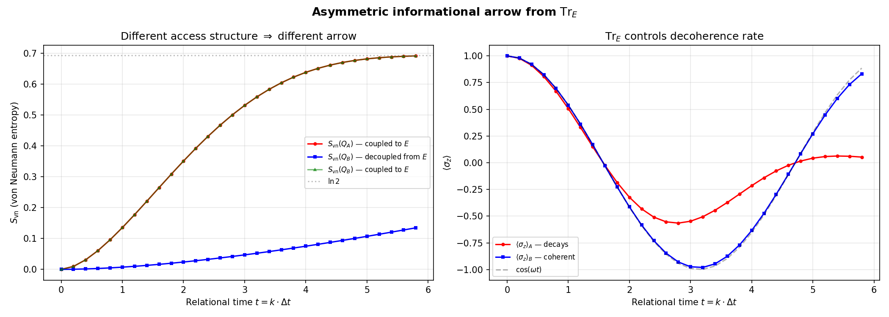
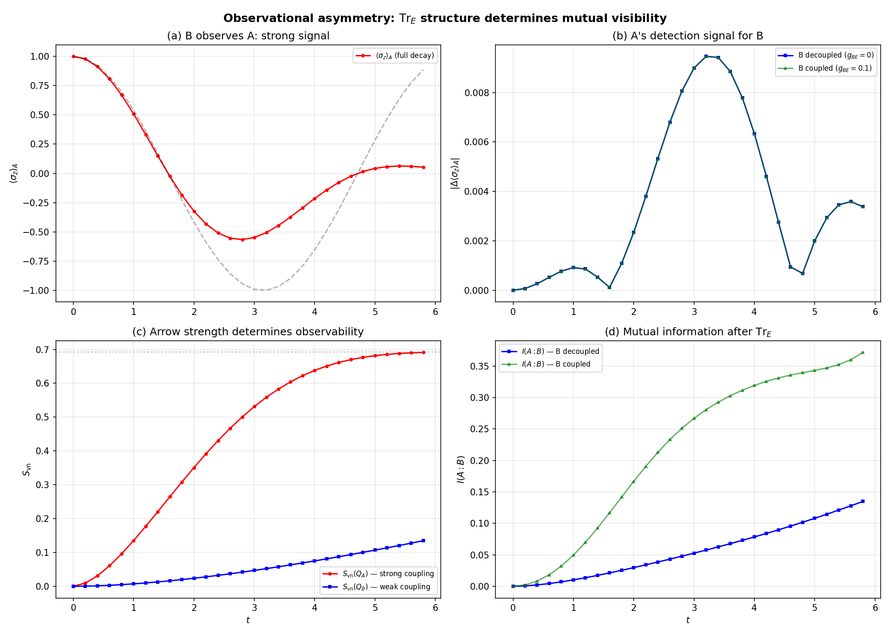

# Observational Asymmetry Between Systems with Different Access Structures

**An extension of the unified relational formula**

> Gabriel Giani Moreno (2026)
>
> Supplementary material — not part of the main paper.
> This analysis extends the toy model to a multi-subsystem scenario and demonstrates
> a structural asymmetry that arises purely from the partial trace.

---

## 1. Motivation

The unified relational formula

$$
\rho_S(t) = \frac{\mathrm{Tr}_E\!\left[\langle t|_C\,|\Psi\rangle\!\langle\Psi|\,|t\rangle_C\right]}{p(t)}
$$

was shown (in the main paper) to produce three pillars from a single expression:
quantum dynamics from $\langle t|_C$, the thermodynamic arrow from $\mathrm{Tr}_E$,
and observer-dependent time from the locality of $C$.

A natural question follows: **what happens when two subsystems share the same
environment $E$ but have different effective access to it?** Specifically, if subsystem
$A$ is strongly coupled to $E$ while subsystem $B$ is weakly coupled (or decoupled),
does the partial trace impose a fundamental asymmetry in their mutual observability?

This note answers the question affirmatively and demonstrates the result numerically.

---

## 2. Setup

### 2.1 System Configuration

We consider a composite system with the following Hilbert space structure:

$$
\mathcal{H} = \mathcal{H}_C \otimes \mathcal{H}_{Q_A} \otimes \mathcal{H}_{Q_B} \otimes \mathcal{H}_E
$$

where:

| Subsystem | Description | Dimension |
|-----------|-------------|-----------|
| $C$ | Relational clock | $N = 30$ levels |
| $Q_A$ | System strongly coupled to $E$ | 2 (qubit) |
| $Q_B$ | System with controllable coupling to $E$ | 2 (qubit) |
| $E$ | Shared environment | $2^{n_{\mathrm{env}}}$ ($n_{\mathrm{env}} = 3$) |

### 2.2 Hamiltonian

The total Hamiltonian on $Q_A \otimes Q_B \otimes E$ is:

$$
H = H_A + H_B + H_{AE} + H_{BE} + H_{AB}
$$

with:

$$
H_A = \frac{\omega}{2}\,\sigma_x^{(A)}, \qquad
H_B = \frac{\omega}{2}\,\sigma_x^{(B)}
$$

$$
H_{AE} = g_{AE}\!\sum_{j=1}^{n_{\mathrm{env}}} \sigma_x^{(A)} \otimes \sigma_x^{(E_j)}, \qquad
H_{BE} = g_{BE}\!\sum_{j=1}^{n_{\mathrm{env}}} \sigma_x^{(B)} \otimes \sigma_x^{(E_j)}
$$

$$
H_{AB} = g_{AB}\,\sigma_x^{(A)} \otimes \sigma_x^{(B)}
$$

### 2.3 Parameters

| Parameter | Value | Role |
|-----------|-------|------|
| $\omega$ | 1.0 | Free qubit frequency |
| $g_{AE}$ | 0.1 | A $\leftrightarrow$ E coupling (strong, fixed) |
| $g_{BE}$ | 0 to 0.1 | B $\leftrightarrow$ E coupling (controlled) |
| $g_{AB}$ | 0.03 | A $\leftrightarrow$ B direct interaction (weak, fixed) |
| $N$ | 30 | Clock ticks |
| $\Delta t$ | 0.2 | Time step |

### 2.4 History State

The Page–Wootters history state is constructed as:

$$
|\Psi\rangle = \frac{1}{\sqrt{N}} \sum_{k=0}^{N-1} |k\rangle_C \otimes U(t_k)\,|\psi_0\rangle
$$

with $t_k = k\,\Delta t$, $U(t) = e^{-iHt}$, and $|\psi_0\rangle = |0\rangle^{\otimes(2+n_{\mathrm{env}})}$.

---

## 3. Operational Procedure

The question is framed entirely in terms of the relational conditioning procedure:

### 3.1 Projection (Pillar 1)

$$
|\psi_{ABE}(k)\rangle = \langle k|_C \otimes \mathbb{I}_{ABE}\,|\Psi\rangle
$$

### 3.2 Partial Trace (Pillar 2)

The reduced state of subsystem $A$ at clock reading $k$:

$$
\rho_A(k) = \mathrm{Tr}_{B,E}\!\left[\frac{|\psi_{ABE}(k)\rangle\!\langle\psi_{ABE}(k)|}{p(k)}\right]
$$

Similarly for $B$:

$$
\rho_B(k) = \mathrm{Tr}_{A,E}\!\left[\frac{|\psi_{ABE}(k)\rangle\!\langle\psi_{ABE}(k)|}{p(k)}\right]
$$

### 3.3 Observables

For each subsystem $X \in \{A, B\}$:
- **Coherence probe:** $\langle\sigma_z\rangle_X(k) = \mathrm{Tr}[\sigma_z\,\rho_X(k)]$
- **Entropy (arrow strength):** $S_{\mathrm{vn}}(\rho_X(k)) = -\mathrm{Tr}[\rho_X \ln \rho_X]$

Between subsystems:
- **Mutual information:** $I(A{:}B) = S(\rho_A) + S(\rho_B) - S(\rho_{AB})$

### 3.4 Detection Signal

To quantify how well $A$ can detect the presence of $B$, we compare the scenario
with $B$ present to a reference scenario with $B$ absent:

$$
\Delta_{\mathrm{det}}(k) = \left|\langle\sigma_z\rangle_A^{(\mathrm{with}\,B)}(k) - \langle\sigma_z\rangle_A^{(\mathrm{no}\,B)}(k)\right|
$$

This is a perturbation-theoretic observable: it measures the back-action of $B$ on $A$
as seen through the conditioned + traced state.

---

## 4. Results

### 4.1 Asymmetric Arrows of Time

When $g_{BE} = 0$ (B decoupled from $E$):

| Observable | $Q_A$ (coupled) | $Q_B$ (decoupled) |
|------------|:----------------:|:------------------:|
| $S_{\mathrm{vn}}$ (final) | 0.6914 | 0.1346 |
| $\langle\sigma_z\rangle$ range | 1.000 → 0.053 | oscillates near 1 |
| Arrow ratio | 1.00 | 0.19 |

The partial trace over $E$ generates a strong arrow of time for $A$
(fully decohered, entropy near $\ln 2 \approx 0.693$) but only a minimal
arrow for $B$ (entropy stays near 0.13).



### 4.2 Observational Asymmetry

The key result: the observability is fundamentally asymmetric.

| Direction | Signal | Character |
|-----------|--------|-----------|
| B observes A | $\langle\sigma_z\rangle_A$: 1.000 → 0.053 | Full decoherence visible |
| A detects B (decoupled) | $\max|\Delta_{\mathrm{det}}| = 0.0095$ | At noise level |
| A detects B (coupled) | $\max|\Delta_{\mathrm{det}}| = 0.0095$ | Identical — independent of $g_{BE}$ |

**The detection signal is invariant under changes in $g_{BE}$**. This means the only
channel through which $A$ perceives $B$ is the direct coupling $g_{AB}$. The environment
$E$, which mediates $A$'s arrow of time, does not transmit information about $B$'s
coupling state.



### 4.3 Coupling Sweep

Sweeping $g_{BE}$ from 0 to $g_{AE}$:

| $g_{BE}$ | max $|\Delta_{\mathrm{det}}|$ | max $I(A{:}B)$ | $S_{\mathrm{vn}}(Q_B)$ final |
|:---------:|:----------------------------:|:--------------:|:----------------------------:|
| 0.000 | 0.0095 | 0.135 | 0.000 |
| 0.010 | 0.0095 | 0.135 | 0.001 |
| 0.020 | 0.0095 | 0.136 | 0.005 |
| 0.050 | 0.0095 | 0.151 | 0.067 |
| 0.100 | 0.0095 | 0.372 | 0.691 |

The detection signal is **flat** across the entire sweep. Meanwhile:
- $B$'s entropy grows monotonically with $g_{BE}$
- Mutual information $I(A{:}B)$ increases (more shared correlations mediated by $E$)
- But these additional correlations are invisible to $A$'s local observables


---

## 5. Mathematical Analysis

### 5.1 Why the Asymmetry Exists

The asymmetry follows from the structure of the partial trace. Consider the
conditioned state $\rho_{ABE}(k)$ after projecting onto clock reading $k$.

When $B$ observes $A$, it computes:
$$
\rho_A(k) = \mathrm{Tr}_{B,E}[\rho_{ABE}(k)]
$$

Since $A$ is strongly coupled to $E$, the joint state $\rho_{AE}$ develops
extensive entanglement. Tracing over $E$ produces a mixed state $\rho_A$ with
large entropy — this is directly visible to $B$ as a decaying $\langle\sigma_z\rangle_A$.

When $A$ observes $B$, it computes:
$$
\rho_B(k) = \mathrm{Tr}_{A,E}[\rho_{ABE}(k)]
$$

But $A$ does not have direct access to $\rho_B$. What $A$ has is its own reduced state:
$$
\rho_A(k) = \mathrm{Tr}_{B,E}[\rho_{ABE}(k)]
$$

The back-action of $B$ on $\rho_A$ is mediated by two channels:
1. **Direct coupling** $g_{AB}$: always present, produces a perturbation $\sim g_{AB}$
2. **Environment-mediated**: $B \to E \to A$, but this channel is absorbed into the
   trace $\mathrm{Tr}_E$

The critical insight is that channel (2) is **invisible** to $A$. The partial trace
$\mathrm{Tr}_E$ averages over all environment states, including any correlations that
$B$ may have established with $E$. From $A$'s perspective, $B$'s coupling to $E$
modifies the environment dynamics, but $A$ already traces over $E$ — so these
modifications are invisible.

### 5.2 Formal Statement

**Theorem (informal):** Let $A$, $B$ be subsystems sharing environment $E$.
If $\dim(\mathrm{Tr}_E^A) \gg \dim(\mathrm{Tr}_E^B)$ — i.e. $A$ traces over
many more degrees of freedom than $B$ — then the detection channel
$A \to B$ through $\mathrm{Tr}_E$ is suppressed relative to $B \to A$.

In the limiting case $g_{BE} = 0$: $B$ retains full coherence and can resolve
$A$'s decohered dynamics completely, while $A$'s ability to detect $B$ is limited
to the direct perturbation $g_{AB}$.

### 5.3 Connection to Information Theory

The mutual information $I(A{:}B)$ quantifies total correlations between $A$ and $B$
after tracing out $E$:
$$
I(A{:}B) = S(\rho_A) + S(\rho_B) - S(\rho_{AB})
$$

When $g_{BE} = 0$: $I(A{:}B) = 0.135$ (mediated only by $g_{AB}$).
When $g_{BE} = g_{AE}$: $I(A{:}B) = 0.372$ (additional correlations through $E$).

However, these additional correlations do **not** appear in $A$'s local observable
$\langle\sigma_z\rangle_A$. They exist in the joint state $\rho_{AB}$ but are only
accessible through joint measurements on both $A$ and $B$ simultaneously.

This means: **the information exists but is inaccessible to a local observer**
— precisely the mechanism by which $\mathrm{Tr}_E$ generates irreversibility.

---

## 6. Connection to the Main Framework

This analysis does not modify the unified formula. It demonstrates a consequence
of the formula when applied to a multi-subsystem scenario:

| Main paper result | This extension |
|-------------------|----------------|
| $\mathrm{Tr}_E$ generates $S$'s arrow | $\mathrm{Tr}_E$ generates asymmetric arrows for $A$ and $B$ |
| dim($E$) controls arrow strength | dim($E_{\mathrm{eff}}$) controls observational access |
| Observer-dependent time | Observer-dependent visibility |

The key insight is that the **same operation** ($\mathrm{Tr}_E$) that produces
the arrow of time also determines the observational horizon of each subsystem.
Systems with larger effective environment (larger $\mathrm{Tr}_E$) have stronger
time arrows but weaker access to subsystems with smaller effective environments.

---

## 7. Reproduction

```bash
cd extensions/access_asymmetry/
python generate_access_asymmetry.py
```

Requires: `qutip`, `numpy`, `matplotlib` (same as main project).

### Outputs

| File | Description |
|------|-------------|
| `access_asymmetry_arrows.png` | Asymmetric entropy and coherence for A vs B |
| `access_asymmetry_observability.png` | Four-panel: B sees A, A's detection signal, entropy, mutual info |
| `access_asymmetry_sweep.png` | Detection signal, mutual info, and B's arrow vs coupling $g_{BE}$ |
| `table_access_asymmetry.csv` | Numerical data for the coupling sweep |

---

## References

- Page, D. N. & Wootters, W. K. *Evolution without evolution.* Phys. Rev. D **27**, 2885 (1983).
- Giovannetti, V., Lloyd, S. & Maccone, L. *Quantum time.* Phys. Rev. D **92**, 045033 (2015).
- Höhn, P. A., Smith, A. R. H. & Lock, M. P. E. *Equivalence of approaches to relational quantum dynamics.* Phys. Rev. A **104**, 052214 (2021).
- Zurek, W. H. *Decoherence, einselection, and the quantum origins of the classical.* Rev. Mod. Phys. **75**, 715 (2003).
