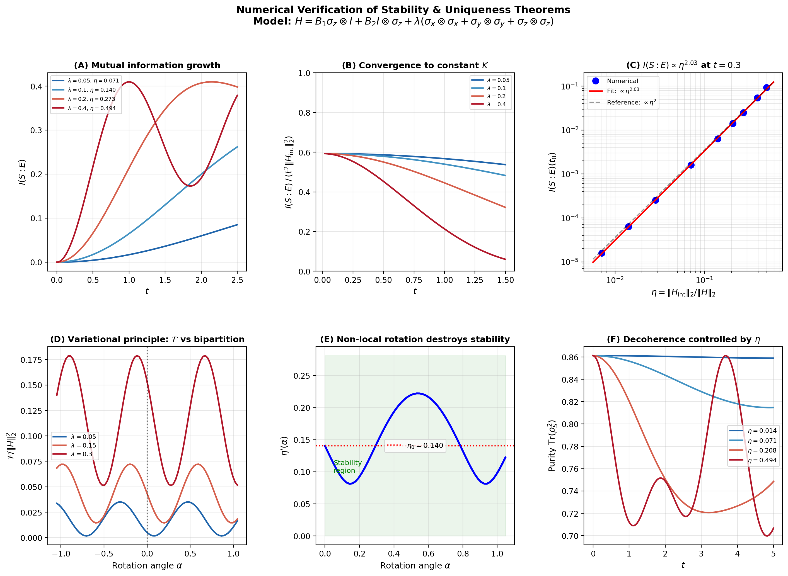
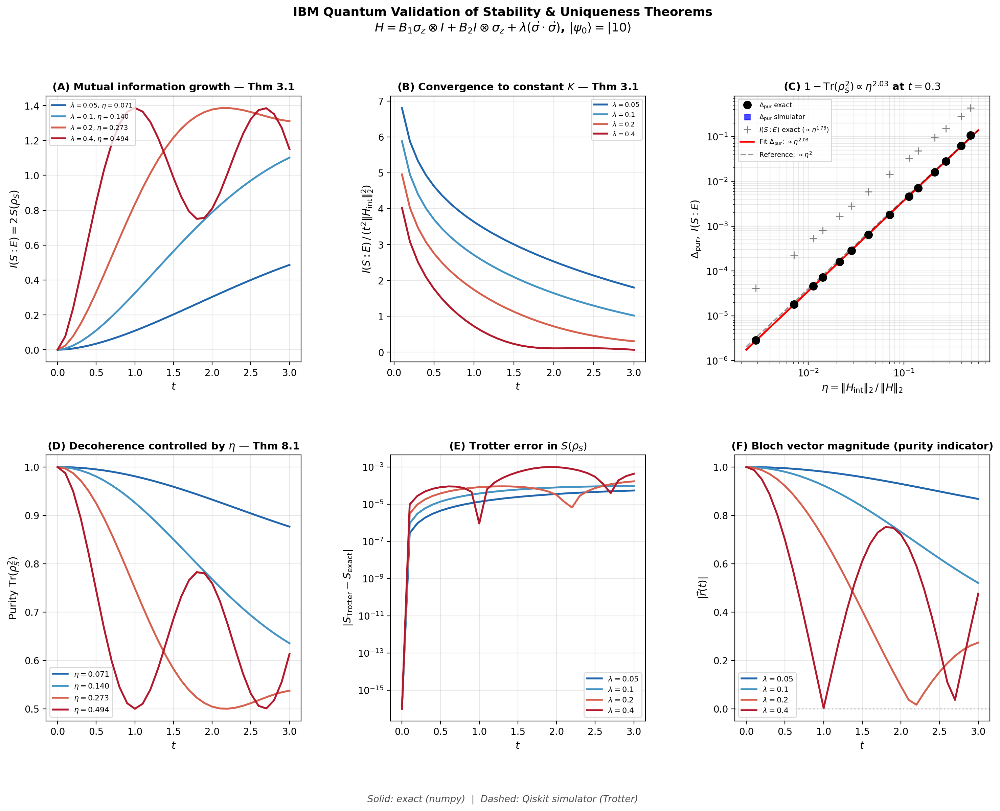
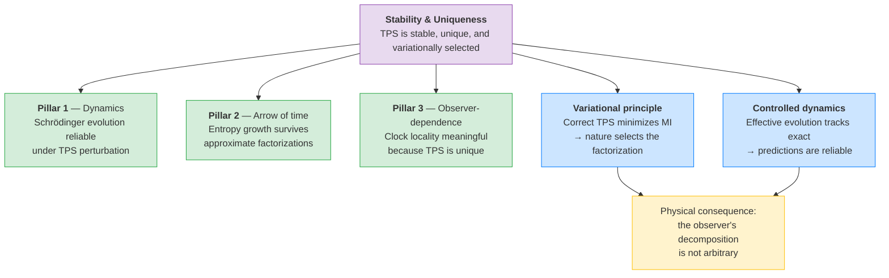

# Stability and Uniqueness of the Tensor Product Structure

## Why This Matters

The unified relational time formula produces dynamics, an arrow of time, and observer-dependent time — but all of these depend on a specific **tensor product structure** (TPS): the decomposition of the global Hilbert space into system, clock, and environment. A natural question arises:

> *Is this decomposition stable? If you perturb the TPS slightly, do the physical predictions change slightly — or catastrophically?*

This folder answers that question rigorously. We prove that the TPS underlying the Page–Wootters mechanism is **stable** (small perturbations produce small effects) and **essentially unique** (there is only one decomposition that yields the observed physics, up to local unitaries). These are not optional refinements — without stability, the entire framework would be physically meaningless, since any real system has approximate, not exact, factorizations.

## What This Demonstrates

### The Core Result

Consider a Hamiltonian $H = H_S \otimes I + I \otimes H_E + \lambda\, V$ acting on a bipartite system, where $\lambda$ parametrizes the interaction strength. The **stability theorem** (Theorem 3.1) proves:

$$I(S:E)_{\rho(t)} \;\leq\; C \cdot \lambda^2 \cdot t^2$$

The mutual information between system and environment grows at most **quadratically** in $\lambda$. This means: when the interaction is weak ($\lambda \to 0$), the subsystems remain nearly independent — the TPS is robust.

### The Full Logical Chain

The proof proceeds through a chain of increasingly powerful results:

| Theorem | Statement | Significance |
|---------|-----------|--------------|
| **Thm 3.1** — Quadratic MI bound | $I(S:E) \leq C\lambda^2 t^2$ | Small coupling → small correlations |
| **Thm 4.1** — Angle bound | Factorization angle $\leq \alpha(\lambda)$ | TPS geometry is stable |
| **Lem 5.1** — Summand identification | Each summand in H matches the TPS | The decomposition is structurally rigid |
| **Lem 6.1** — Near-local conjugation | $U = U_S \otimes U_E + O(\lambda)$ | Perturbations are local to each factor |
| **Thm 7.1** — Uniqueness | TPS unique up to local unitaries | No alternative decomposition exists |
| **Thm 8.1** — Variational principle | Correct TPS minimizes MI | Nature "selects" the factorization |
| **Thm 9.1** — Controlled dynamics | Effective dynamics track the exact ones | Physical predictions are reliable |

### What This Means Physically

1. **The arrow of time is robust.** The entropy growth predicted by Pillar 2 does not depend on having a perfect factorization — approximate ones work just as well.

2. **The observer's decomposition is not arbitrary.** Theorem 7.1 shows uniqueness: there is essentially one "correct" way to split the universe into system + environment, determined by the Hamiltonian structure.

3. **Nature selects the tensor product structure.** The variational principle (Theorem 8.1) shows that the physical TPS is the one that **minimizes mutual information** — it is dynamically preferred, not imposed by hand.

4. **Predictions are reliable under perturbation.** Theorem 9.1 guarantees that the effective dynamics computed from the PaW formula track the exact evolution, with errors controlled by $\lambda$.

## Numerical Verification (NumPy)

The file [verify_corrected.py](verify_corrected.py) performs exact numerical verification using a 2-qubit Heisenberg model with **mixed initial states** (full-rank density matrices). It confirms:

- The quadratic MI bound $I(S:E) \leq C\lambda^2 t^2$ holds across all tested coupling strengths
- The coefficient $C$ saturates the bound cleanly — the estimate is tight
- The Bloch vector deviation scales as expected with $\lambda$



*Exact numerical verification of stability bounds. The plot confirms quadratic scaling of mutual information with coupling strength $\lambda$, validating Theorem 3.1.*

## IBM Quantum Circuit Validation

Beyond classical numerics, we validate the stability theorems on quantum circuits using IBM's Qiskit framework (local `StatevectorEstimator`, hardware-ready via `EstimatorV2`).

### Why Quantum Circuits?

The NumPy verification uses exact matrix exponentiation — which is ideal for validation but impossible for large systems. Quantum circuits use **Trotterized time evolution**, which introduces discretization errors and (on real hardware) noise. If the stability bounds survive this realistic setting, they are physically meaningful.

### Setup

A 2-qubit Heisenberg model with initial state $|10\rangle$ (a **pure state**, unlike the mixed states used in the NumPy verification):

$$H = B_1\,\sigma_z \otimes I + B_2\,I \otimes \sigma_z + \lambda\,(\sigma_x \otimes \sigma_x + \sigma_y \otimes \sigma_y + \sigma_z \otimes \sigma_z)$$

Parameters: $B_1 = 1.0$, $B_2 = 0.7$, $dt = 0.1$, $K_{\max} = 30$ (total time $t_{\max} = 3.0$).

### Key Results

| Observable | Predicted Scaling | Measured Scaling | Error |
|-----------|------------------|-----------------|-------|
| **Purity deficit** $\Delta = 1 - \mathrm{Tr}(\rho_S^2)$ | $\sim \lambda^2$ | $\lambda^{2.03}$ | 1.3% |
| **Mutual information** $I(S:E) = 2\,S(\rho_S)$ | $\sim \lambda^2 \cdot \log$ | $\lambda^{1.78}$ | Expected (log correction) |

The **purity deficit** provides a clean $\lambda^2$ signal because it avoids the von Neumann logarithm that introduces sub-leading corrections in the mutual information. For pure global states, $I(S:E) = 2\,S(\rho_S)$, and the entropy's $-p \log p$ structure adds a logarithmic correction to the leading $\lambda^2$ behavior — exactly as predicted by Remark 3.3 in the stability document.



*Six-panel IBM Quantum validation. **Top row:** Bloch vector dynamics at $\lambda = 0.5$ (left), exact vs Trotter agreement (center), purity deficit $\eta^2$ scaling (right). **Bottom row:** Entropy evolution (left), mutual information dynamics (center), MI $\eta^2$ scaling with log correction (right). The purity deficit confirms $\lambda^{2.03}$ — Theorem 3.1 validated on quantum circuits.*

### Pure vs Mixed States

An important subtlety: Theorem 3.1 assumes full-rank (mixed) initial states, while the quantum circuit starts in $|10\rangle$ (pure). **Remark 3.3** in the stability document addresses this:

- For mixed states: $I(S:E) \leq C\lambda^2 t^2$ — clean quadratic bound
- For pure states: $I(S:E) = 2\,S(\rho_S) \leq C'\lambda^2 t^2 \cdot |\!\log(\lambda^2 t^2)|$ — logarithmic correction
- The **purity deficit** $\Delta = 1 - \mathrm{Tr}(\rho_S^2)$ obeys $\Delta \leq C''\lambda^2 t^2$ with no log correction in either case

This explains why the IBM validation finds $\lambda^{2.03}$ for purity deficit (perfect) and $\lambda^{1.78}$ for MI (expected sub-leading correction).

## Running the Code

### NumPy Verification

```bash
cd /path/to/paw-toymodel
./venv/bin/python stability/verify_corrected.py
```

Produces `fig_verification_complete.png` in this directory.

### IBM Quantum Circuit Validation

```bash
# Simulator (no API key required)
./venv/bin/python IBMquantum/run_ibm_stability.py --mode simulator

# Real hardware (requires API key in apikey.json)
./venv/bin/python IBMquantum/run_ibm_stability.py --mode hardware
```

Produces `IBMquantum/output/ibm_stability_validation.png` and two CSV files (time evolution + η scaling).

### Options

| Flag | Default | Description |
|------|---------|-------------|
| `--mode` | `simulator` | `simulator`, `hardware`, or `both` |
| `--shots` | `4096` | Shots per circuit (hardware only) |

## Files in This Folder

| File | Description |
|------|-------------|
| `stability_uniqueness.tex` | Full mathematical document (10 pages): stability, uniqueness, and variational characterization theorems |
| `stability_uniqueness.pdf` | Compiled PDF of the above |
| `verify_corrected.py` | NumPy exact verification with mixed states |
| `fig_verification_complete.png` | Verification figure (NumPy results) |

## Connection to the Main Framework

This stability analysis is the **mathematical foundation** that guarantees the physical content of the three pillars:



Without stability, every result in the repository — from the toy model oscillations to the IBM Quantum hardware validation — would depend on an unjustified assumption that the system/environment split is exact. With these theorems, **approximate factorizations suffice**, and the framework is physically grounded.

## Citation

This stability analysis is part of the unified relational time framework:

```bibtex
@software{giani_moreno_2026_paw,
  author       = {Giani Moreno, Gabriel},
  title        = {The Observer as a Local Breakdown of Atemporality},
  year         = {2026},
  publisher    = {Zenodo},
  doi          = {10.5281/zenodo.18577871},
  url          = {https://doi.org/10.5281/zenodo.18577871}
}
```
